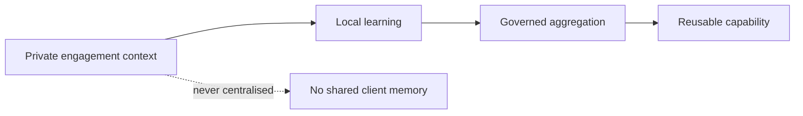
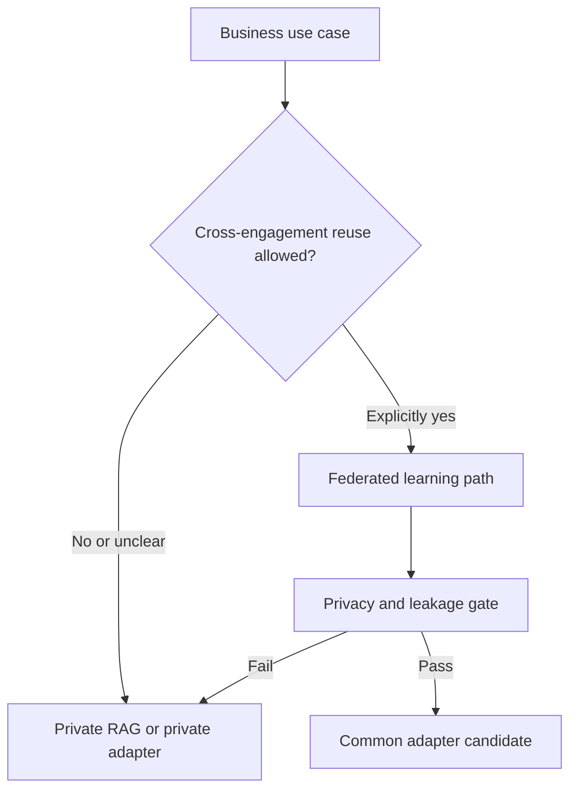

# Federated Consulting Knowledge Fabric

[Overview](README.md) · [Architecture](docs/en/architecture.md) · [Deployment](docs/en/deployment.md) · [Workflow](docs/en/workflow.md) · [Toolchain](docs/en/toolchain.md) · [Governance](docs/en/governance.md) · [Deutsch](de/README.md)

> Independent exploratory reference architecture. This is not an official NVIDIA product, legal opinion, customer implementation, or production approval.

**Presentation site:** [ofunk-nvidia.github.io/Federated](https://ofunk-nvidia.github.io/Federated/)

## The executive idea

A strategy consultancy works across many confidential client engagements. Each engagement may contain valuable methods and experience, but contractual information barriers prevent client knowledge from becoming a shared corporate memory.

This concept asks whether the consultancy can improve reusable analytical capabilities without centralising client documents or exposing one engagement to another.

The answer is not “put all documents into one model.” The proposed pattern separates three layers:

1. a common base model;
2. a shared adapter trained only from explicitly reusable learning signals;
3. private retrieval and adapters that remain inside each engagement boundary.

## Why it matters

| Executive concern | Architectural response |
|---|---|
| Client confidentiality | Raw documents and private model components remain local |
| Information barriers | Existing identities and permissions remain authoritative |
| Reuse of experience | Only approved, abstracted learning signals enter aggregation |
| Competition and copyright risk | Classification, minimum cohorts, privacy controls, leakage tests, and legal review |
| Auditability | Decisions, training rounds, releases, and residual risks produce evidence |

## Core proposition

> A consultant may use knowledge within an authorised engagement. The consultancy may not automatically reuse that knowledge across engagements.

Federated learning is therefore an enforcement and coordination mechanism, not a legal shortcut. NVIDIA FLARE is evaluated as the orchestration layer; local training, evaluation, privacy engineering, and release governance remain distinct responsibilities.

## What this repository contains

- a reference architecture for separated private and reusable knowledge paths;
- a workflow for a synthetic proof of concept in a separate private repository;
- an open-source-oriented NVIDIA toolchain assessment;
- governance, threat-model, and release-gate principles;
- GitHub-renderable Markdown and Mermaid visuals.

It contains no customer project, dataset, source repository, model weight, adapter, checkpoint, production configuration, or training run.

## Decision path

## Recommended reading

1. [Architecture](docs/en/architecture.md)
2. [Deployment](docs/en/deployment.md)
3. [Workflow](docs/en/workflow.md)
4. [Toolchain](docs/en/toolchain.md)
5. [Governance](docs/en/governance.md)

Operational instructions are kept outside this executive narrative in [AGENTS.md](AGENTS.md), [PUBLICATION_POLICY.md](PUBLICATION_POLICY.md), and [CONTRIBUTING.md](CONTRIBUTING.md).

## Current status

Concept ready for executive and technical discussion. No claim of legal safety or production readiness is made. The next implementation step, if approved, is a synthetic three-site POC in a separate private repository.
