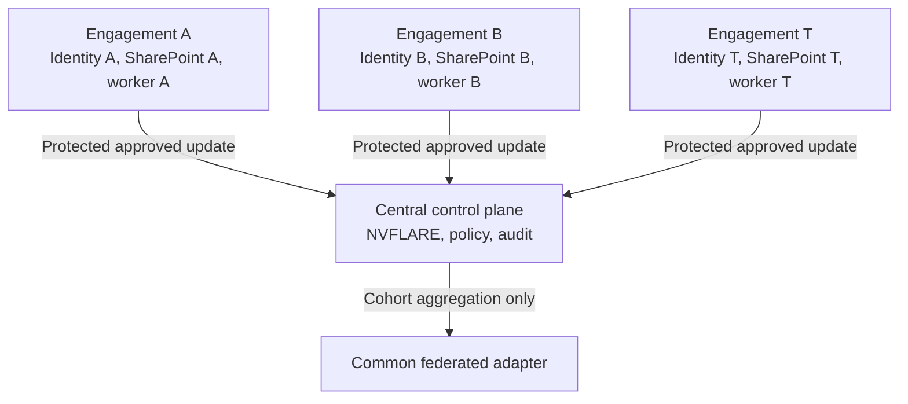
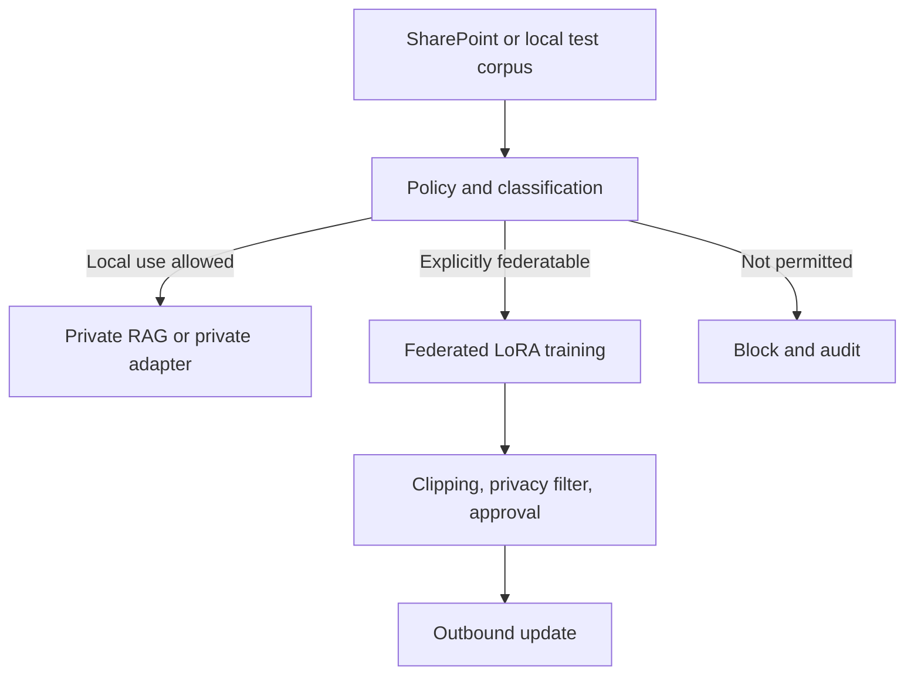

# Federated Consulting Knowledge Fabric

## Single-file project brief for Codex

**Version:** 0.2  
**Date:** 13 September 2026  
**Status:** Concept and proof-of-concept specification; not approved for production data  
**Scenario:** A strategy consultancy with 20 isolated client engagements using Microsoft SharePoint, Entra ID, Purview Information Barriers, and NVIDIA FLARE

---

## 0. Binding instructions for Codex

Read this file completely before taking action. Treat it as the authoritative project brief.

### Language rule

**All Codex output must be in English, even when the user writes or answers in German.** This includes plans, questions, explanations, source code, code comments, configuration, documentation, test reports, commit messages, issues, and pull requests. Preserve original-language quotations only when legally or technically necessary, and accompany them with an English explanation.

### Mission

Build a locally reproducible and auditable proof of concept with three simulated client engagements. The POC must test whether isolated environments can learn a shared, abstract capability from locally stored documents without sending raw documents, private adapters, or client-identifiable knowledge across engagement boundaries.

This is not yet a production deployment. Work in phases:

1. Inspect the repository, Git status, operating system, Python version, GPU/CUDA availability, container support, and available resources.
2. Validate the current official NVFLARE, PEFT, and Microsoft documentation relevant to the chosen implementation.
3. Produce a concise implementation plan listing assumptions, decisions, dependencies, and risks.
4. Build a fully synthetic local simulation before connecting to SharePoint or any external tenant.
5. Implement automated tests for engagement isolation, data leakage, update isolation, policy enforcement, and reproducibility.
6. Report results and limitations honestly. A capability is not considered implemented merely because a vendor documents it.
7. Stop before accessing a real Microsoft 365 tenant, creating Entra applications, deploying cloud resources, downloading a model that requires accepting a licence, incurring cost, or using real client data. State the proposed next step and the approval required.

### Non-negotiable working rules

- Never use real client, employee, pricing, bid, M&A, capacity, or strategy data in the POC.
- Never store passwords, tokens, certificates, keys, or secrets in Git, logs, notebooks, fixtures, or configuration files.
- Never design a central application with tenant-wide `Sites.Read.All` access.
- Never claim that federated learning removes copyright, competition, confidentiality, trade-secret, privacy, or contractual risk.
- Preserve existing access controls end to end. An AI component must never read more than its assigned engagement identity can read.
- Keep changes small, testable, reviewable, and reversible.
- Record material architecture decisions as ADRs or an equivalent durable decision log.
- Explicitly document residual risks where a requirement cannot be guaranteed.
- Use official primary technical sources for implementation decisions and record exact dependency versions.

### Expected result of the first implementation stage

- A reproducible local development environment.
- Three logically and technically separated engagement simulators.
- One identical small base model and identical PEFT/LoRA structure at every site.
- A private knowledge path and a federatable learning path for each engagement.
- Aggregation of explicitly approved learning signals only.
- Canary secrets and automated leakage tests.
- Audit events for classification, approval, training, update export, aggregation, evaluation, and release.
- One documented command to start the POC and one to run all tests.
- A report distinguishing what the POC proves from what it does not prove.

---

## 1. Problem statement

A strategy consultancy serves approximately 20 clients in parallel. Documents and working materials are stored in Microsoft SharePoint. Contractual, organisational, and technical information barriers separate the engagements. Consultants may access only engagements to which they are assigned. The material may be copyrighted, confidential, personal, protected as a trade secret, or competitively sensitive.

The product hypothesis is that the consultancy can improve general consulting capabilities by learning from recurring patterns across engagements without copying the 20 datasets into a central training corpus, data lake, or vector database. NVIDIA FLARE is the candidate orchestration layer for federated learning. Microsoft Entra ID, SharePoint permissions, and Microsoft Purview Information Barriers remain the authoritative access boundary.

The simplistic hypothesis—“only weights leave the engagement, therefore there is no legal problem”—is rejected. Model parameters and updates can encode information about training examples or enable inference about them.

The working hypothesis is narrower:

> Only pre-classified, technically constrained, sufficiently aggregated, and leakage-tested learning signals may leave an engagement. Raw data, identifiable client knowledge, private model components, and individual updates remain within the engagement boundary.

---

## 2. Objectives and non-goals

### Objectives

- Continue the consultancy’s existing information barriers into AI retrieval and training.
- Keep source documents under the control of SharePoint, Entra ID, and Purview.
- Separate local client utility from cross-engagement learning.
- Learn general methods and capabilities without building a shared memory of client facts.
- Make every relevant policy decision, training run, update, aggregation, evaluation, and release auditable.
- Measure privacy, quality, performance, and operational trade-offs rather than assuming them.
- Establish evidence for a later legal, security, privacy, and competition-law decision.

### Non-goals

- Declaring the design legally risk-free.
- Training a foundation model from scratch.
- Combining incompatible model architectures by averaging their weights.
- Building a global search engine over all client documents.
- Allowing consultants to query facts learned from other engagements.
- Using production SharePoint sites or real client data in the initial POC.
- Proving mathematically that no information can ever be extracted from a released model.

---

## 3. Target model architecture

The platform must not be one global model that “knows” all client material. It has three distinct knowledge layers:

1. **Global base model:** The same foundation model is deployed at all sites. It is frozen during the initial POC.
2. **Common federated adapter:** A shared LoRA/PEFT adapter trained only from approved and abstractable learning signals.
3. **Private engagement layer:** A private adapter and/or local retrieval-augmented generation environment for each engagement. This layer never leaves the engagement.

For a consultant assigned to engagement A, inference is conceptually:

```text
Base model
+ Common federated adapter
+ Private adapter A
+ RAG context from SharePoint A
```

Engagement B receives its own isolated composition. Neither a user in B nor the common adapter should be able to reveal confidential facts originating from A.

---

## 4. Core architecture principles

### 4.1 The information barrier is continuous

SharePoint, Entra ID, and Purview determine which identity may read which content. AI components do not replace, bypass, or broaden these permissions. Every engagement worker has a separate workload identity, credentials, runtime, storage, logs, and outbound policy.

### 4.2 Access and export are separate decisions

Permission to use a document locally for an engagement-specific answer does not imply permission to derive a cross-engagement model contribution from it. At least two independent policy questions must be evaluated:

1. May the local worker read and use the content for local RAG?
2. May the content contribute a learning signal to federated aggregation?

The second decision must be more restrictive than the first.

### 4.3 No central client memory

The common adapter should improve general methods and capabilities, such as structuring a transformation programme, applying a generic quality checklist, or classifying document types. It must not become a memory of individual prices, plans, bids, customers, capacities, transactions, names, or strategy decisions.

### 4.4 Least privilege and separate identities

In a later Microsoft 365 lab, each engagement worker receives a distinct Entra workload identity or service principal. It receives selected access only to its assigned SharePoint site—or to a still narrower list, folder, or item scope where appropriate. A shared super-application with broad tenant access is outside the target architecture.

### 4.5 Assume breach

The design assumes that an aggregator, training job, client, operator, or administrator may be compromised. Individual updates must therefore not be unnecessarily visible. Site policies, job allowlists, update clipping, minimum cohorts, differential privacy, robust aggregation, and cryptographic protection are complementary controls.

### 4.6 Verify controls

Every important claim needs a test or inspectable configuration. “Worker A cannot read site B” requires a negative access test. “The common adapter does not reveal Canary A” requires defined extraction and memorisation tests. Documentation alone is not evidence that the selected combination works.

---

## 5. Logical architecture



Inside each engagement:



Trust boundaries must be documented between:

- Microsoft 365 and each worker;
- one engagement worker and another;
- each worker and the NVFLARE control plane;
- the aggregator and model-release process;
- model operators and end users;
- operational telemetry and confidential content.

---

## 6. Data classification and permitted uses

Every item must receive a usage classification before indexing or training. The POC uses synthetic metadata and deterministic rules. A later automated classifier may support—but must not silently replace—human, contractual, or legal approval.

| Class | Description | Examples | Permitted processing |
|---|---|---|---|
| A — Public | Lawfully public and usable for the stated purpose | Public reports and approved publications | RAG and potentially federated training |
| B — Abstractable method | Methods or patterns explicitly approved for cross-engagement reuse | Generic checklists and approved anonymised methods | Federated adapter after policy checks |
| C — Confidential engagement knowledge | Non-public information usable within one engagement | Internal analysis, project artefacts, client processes | Local RAG or private adapter only |
| D — Highly sensitive | Competitively or personally critical data | Future prices, discounts, bids, capacity, M&A, customer lists, personnel actions | Local RAG with strict controls or complete exclusion; never federate by default |
| E — Unknown or blocked | Rights, provenance, or approval are unclear | Documents without reliable policy metadata | No processing until resolved |

The default rule is: **unknown means blocked**.

Every training example must be traceable to at least:

- engagement identifier;
- source document identifier and version, without centralising document content;
- provenance and rights status;
- usage class;
- local approval rule and timestamp;
- transformation, redaction, or abstraction rule;
- training run and model/adapter version;
- decision: local, federatable, or excluded;
- policy version responsible for the decision.

Policy metadata must not itself disclose client names or sensitive content to the central control plane. Use pseudonymous site identifiers and reason codes.

---

## 7. Technical components

### 7.1 Engagement worker

Each engagement receives an isolated worker. In the local POC, use separate containers or equivalently enforceable process and filesystem boundaries. A production design should separate at least:

- workload identity and certificate;
- network policy;
- document cache and vector store;
- private adapter;
- training workspace;
- logs and local audit buffer;
- outbound FLARE channel;
- secret store and encryption keys.

The worker may run only approved jobs. A centrally submitted job must not execute arbitrary code or read arbitrary local files. Allowlist training recipes, container images, image digests, code hashes, data classes, output schemas, resource limits, and permitted model layers at site level.

### 7.2 Microsoft 365 integration

The production-oriented design should use Microsoft Graph and granular selected permissions. Prefer a distinct identity for every engagement with access only to its site or a smaller approved resource. SharePoint ACLs and Purview Information Barriers remain the source of truth.

The first POC emulates this connector locally. A later tenant lab must explicitly verify:

- app-only behaviour on Information Barrier sites;
- actual effective scope of `Sites.Selected` and any more granular selected permission;
- Entra token claims, Conditional Access, and workload-identity policy;
- site, list, folder, item, and file permissions;
- delta queries, version changes, moves, and deletion handling;
- retention labels, sensitivity labels, DLP, and legal holds;
- revoked access and already-created local artefacts;
- correlation of Entra, Purview, SharePoint, application, and NVFLARE audit events.

### 7.3 Base model and adapters

All sites use the same small, locally runnable base model with a compatible licence. The base model stays frozen. Only adapters with an identical LoRA configuration may participate in aggregation.

Each engagement has two logically separate adapters:

- **Private adapter:** may use approved class C knowledge and possibly tightly controlled class D content. It never leaves the engagement.
- **Federated adapter:** trains exclusively on approved class A and B examples. It is the only model component eligible for aggregation.

Private and federatable examples must never be mixed into an undifferentiated training dataset. Prefer local RAG over private fine-tuning where RAG can meet the use case with less memorisation and easier deletion.

LoRA parameters trained against one model architecture cannot simply be averaged into a structurally different larger model. Moving from an 8B model to a 70B model, for example, is a separate distillation or knowledge-transfer workstream requiring new evaluation and legal review.

### 7.4 NVIDIA FLARE

NVFLARE is the candidate layer for orchestration, client/server communication, job execution, aggregation, site policy, authorisation, and audit integration. First demonstrate basic compatible LoRA aggregation. Add protection mechanisms separately and measure their effect.

Evaluate:

- site policy management;
- role-based and federated authorisation;
- privacy filters;
- update clipping;
- minimum cohort enforcement;
- differential privacy;
- homomorphic encryption or a suitable secure-aggregation mechanism;
- job and model provenance;
- recovery after client or server failure;
- protection against malicious or anomalous client updates.

A mechanism appearing in NVFLARE documentation or example code does not establish its suitability for the selected LLM adapter size. Benchmark compatibility, runtime, memory, communication overhead, operational complexity, and privacy effect.

---

## 7.5 Recommended NVIDIA fine-tuning and post-training toolkit

### Recommendation for the first POC

Use this minimal stack:

```text
Local approved engagement data
    ↓
NeMo Curator + engagement-specific policy filters
    ↓
NeMo AutoModel + LoRA/PEFT
    ↓
NVFLARE for federated training rounds
    ↓
NeMo Evaluator + consulting-specific evaluation gates
    ↓
local inference; optimise serving only after the POC succeeds
```

The key design decision is:

> **NeMo AutoModel with LoRA/PEFT is the local fine-tuning layer. NVFLARE orchestrates federation but does not replace the local training framework.**

Responsibilities remain separate:

- NeMo Curator prepares and checks local training data.
- NeMo AutoModel performs local SFT or PEFT.
- NVFLARE distributes approved jobs and aggregates compatible adapter updates.
- NeMo Evaluator provides a reproducible evaluation framework.
- Project-specific privacy, factuality, consulting-quality, and competition-law tests remain mandatory release gates.

### A. NeMo AutoModel — preferred for SFT and PEFT

[NVIDIA NeMo AutoModel](https://docs.nvidia.com/nemo/automodel/latest/) is the preferred local training framework for the POC. Its current documentation covers Hugging Face compatibility, local and distributed execution, SFT, PEFT, retrieval fine-tuning, and knowledge distillation.

The default configuration is:

```yaml
training_method: LoRA
base_model: frozen
full_parameter_training: false
private_adapter: per_engagement
federated_adapter: separate
```

Full-parameter SFT is not recommended for the first POC. It increases compute demand, artefact size, memorisation risk, rollback complexity, and the scope of legal review. QLoRA may be benchmarked where hardware is constrained, but every federating site must use a demonstrably compatible model, quantisation method, adapter layout, target-layer set, and training contract.

### B. NeMo Curator — local data preparation

[NeMo Curator](https://docs.nvidia.com/nemo/curator/latest/) is recommended for local quality filtering, exact/fuzzy/semantic deduplication, decontamination, classification, PII handling, and synthetic-data workflows.

It must be extended with engagement-specific controls:

- provenance and rights metadata;
- document and data-class policy;
- customer, person, price, bid, capacity, and strategy detection;
- secret and identifier scanning;
- evaluation-set decontamination;
- separation of private examples from federatable class A/B examples;
- rejection of examples with uncertain rights or purpose.

NeMo Curator runs inside the engagement boundary. Raw engagement corpora must not be sent to a shared curation cluster.

### C. NVFLARE — federation and enforcement

[NVIDIA FLARE](https://nvidia.github.io/NVFlare/) remains the federation layer:

```text
NVFLARE job
    ↓
local site policy
    ↓
NeMo-AutoModel LoRA training
    ↓
parameter allowlist + clipping + privacy controls
    ↓
protected adapter update
    ↓
NVFLARE cohort aggregation
```

Each site retains the authority to reject a job. NVFLARE must not centrally decide whether a document is legally or contractually reusable. It may receive only the approved adapter payload and content-minimised audit metadata.

### D. NeMo Evaluator — evaluation framework, not the sole release authority

[NVIDIA NeMo Evaluator](https://docs.nvidia.com/nemo/evaluator/) is recommended for reproducible benchmark execution. Generic LLM benchmarks are insufficient for this use case.

A release decision must combine:

1. task quality on an engagement-independent holdout set;
2. local quality for every participating site;
3. factuality and source-grounding tests;
4. canary, memorisation, membership-inference, and semantic-leakage tests;
5. prohibited competition-sensitive question tests;
6. customer-identity and attribution probes;
7. human review by consulting-domain specialists;
8. regression against the previously released adapter.

An adapter must be blocked if a generic score improves while cross-engagement leakage, unsupported claims, or prohibited capabilities increase.

### E. NeMo RL — later, after reliable feedback exists

[NVIDIA NeMo RL](https://docs.nvidia.com/nemo/rl/latest/) is the preferred later-stage toolkit for preference optimisation and reinforcement-learning post-training. It is deliberately excluded from the initial POC baseline.

Recommended order:

```text
1. RAG and tools without training
2. LoRA-SFT on curated, approved examples
3. preference learning from controlled expert reviews
4. RL only after a robust reward and anti-gaming tests exist
```

Potential consulting-domain reward signals include:

- correct source attribution;
- explicit separation of evidence and inference;
- adherence to an approved analysis method;
- correct handling of uncertainty;
- human preference between two anonymised responses;
- refusal to expose client-specific or competition-sensitive information;
- passing structured factuality and policy tests.

These signals are weaker and more subjective than a compiler or executable test suite. Therefore RL carries a higher risk of reward hacking and stylistic optimisation without factual improvement. Start with high-quality preference pairs and evaluate a direct preference method before considering more complex online RL.

Prompts, reviewer comments, trajectories, rewards, and rollouts may themselves contain confidential engagement information. They inherit the source data classification and are not automatically federatable.

### F. NeMo Framework and Megatron Core — scale-up option

Use the broader [NVIDIA NeMo Framework](https://docs.nvidia.com/nemo-framework/) or Megatron Core only if the project later requires very large models, multi-node execution, full-parameter training, or advanced parallelism that NeMo AutoModel cannot provide adequately.

This is not the POC default. Escalate only when a measured limitation justifies the additional infrastructure and governance burden.

### G. NeMo Microservices — possible productisation layer

NeMo Microservices may later provide API-based enterprise customisation and evaluation workflows. Do not make them the foundation of the first local POC. First validate the training contract, isolation model, policy enforcement, privacy controls, and evidence pipeline directly.

Adoption requires verification that the service can run within the permitted environment, preserves engagement isolation, exposes sufficient policy controls, and does not create a new central path for confidential training data.

### H. TensorRT-LLM or NIM — inference optimisation only

[TensorRT-LLM](https://docs.nvidia.com/tensorrt-llm/) or a suitable NVIDIA NIM may later optimise inference latency, throughput, and deployment. They do not solve training rights, data classification, federation, or leakage. Add them only after model quality and privacy gates succeed.

### Decision matrix

| NVIDIA component | Role | POC | Later |
|---|---|---:|---:|
| NeMo Curator | local curation, deduplication, decontamination | yes, targeted | yes |
| NeMo AutoModel | local SFT/PEFT/LoRA | **yes, core** | yes |
| NVFLARE | federated orchestration and aggregation | yes, after local baseline | yes |
| NeMo Evaluator | reproducible evaluation | yes | yes |
| NeMo RL | preference/RL post-training | no; prepare data model only | optional |
| NeMo Framework/Megatron Core | large-scale or full-parameter training | no | if measured need exists |
| NeMo Microservices | managed productisation layer | no | optional after governance review |
| TensorRT-LLM/NIM | inference optimisation and serving | no | after model validation |

### Minimal technology contract

```yaml
data_preparation:
  framework: NeMo Curator
  location: engagement_environment
  default_policy: deny

fine_tuning:
  framework: NeMo AutoModel
  method: LoRA
  base_model: frozen
  adapters:
    - private_engagement_adapter
    - separate_federated_adapter

federation:
  framework: NVFLARE
  payload: allowlisted_lora_parameters_only
  minimum_cohort: configurable
  plaintext_individual_updates: prohibited_target

post_training:
  phase_1: supervised_fine_tuning
  phase_2: preference_learning_optional
  phase_3: reinforcement_learning_only_with_validated_reward

evaluation:
  framework: NeMo Evaluator
  mandatory_custom_gates:
    - factuality
    - source_grounding
    - cross_engagement_leakage
    - competition_sensitive_queries
    - human_domain_review

inference:
  poc: simple_local_runtime
  production_candidates:
    - TensorRT-LLM
    - NVIDIA NIM
```

### Base-model decision

Select the NVIDIA training stack before fixing a specific base model. Benchmark two or three locally deployable candidates against the project’s actual tasks.

Mandatory criteria:

- licence permits the intended commercial use and fine-tuning;
- weights can be operated inside each engagement boundary;
- NeMo AutoModel or a clean compatible trainer supports the model;
- context length fits approved task units;
- structured output and tool use are sufficiently reliable;
- compute demand matches site hardware;
- adapters can be deterministically stored, loaded, compared, evaluated, and aggregated;
- privacy and memorisation behaviour is acceptable under the project tests.

Do not select a model solely from a public general-purpose benchmark. The project benchmark must measure evidence-grounded consulting tasks, privacy behaviour, policy compliance, and cross-engagement safety.

---

## 8. Federated training workflow

Every permitted training round follows this minimum sequence:

1. The control plane publishes a signed and versioned job specification.
2. Each site verifies the job type, code/image hash, resource limits, permitted data classes, model identity, adapter schema, and export format.
3. The worker reads only documents its own identity is authorised to read.
4. The policy layer separates private, federatable, and excluded examples.
5. Private and federatable data are processed through distinct pipelines and artefact stores.
6. Local training produces only compatible adapter updates.
7. Before export, the site verifies parameter names, allowed layers, tensor shapes, value ranges, update norm, size, and schema.
8. Clipping and, where enabled, differential privacy are applied locally or in the approved protocol position.
9. Individual client updates are not exposed to other participants or ordinary central operators in plaintext.
10. The server aggregates only when the minimum cohort and release rules are satisfied.
11. The candidate common adapter receives an immutable version, configuration, and provenance record.
12. The candidate is evaluated for utility, client leakage, memorisation, prohibited capability, fairness where relevant, and regression.
13. Only an approved candidate is released. Failed candidates are quarantined and never distributed.

No debug mode may weaken these controls without producing a conspicuous audit event and requiring a separate synthetic-only environment.

---

## 9. Threat model

The POC must address at least these scenarios:

| Threat | Example | Expected control and evidence |
|---|---|---|
| Cross-engagement read | Worker A attempts to read B | Separate identity and storage; negative access test |
| Malicious training job | Central job reads private files and encodes them in updates | Signed allowlisted jobs, site policy, export schema, rejection test |
| Individual update inspection | Aggregator analyses update A | Secure aggregation/HE where feasible, role separation, operator test |
| Differencing attack | Aggregate with A minus aggregate without A | Minimum cohort, stable release rules, DP, test scenario |
| Model inversion | Attacker reconstructs training features | Clipping, DP, leakage evaluation, residual-risk statement |
| Memorisation | Common adapter emits a canary or source passage | Extraction tests and release gate |
| Prompt extraction | User B asks targeted questions about A | Exclude C/D from federation, output controls, red-team prompts |
| Poisoning | Compromised site inserts a backdoor | Update anomaly detection, robust aggregation, adversarial test |
| Sybil clients | Operator creates fake clients to defeat thresholds | Strong site identity and admitted-participant registry |
| Credential leakage | Graph token or certificate appears in logs | Secret store, log redaction, short-lived credentials, rotation test |
| Stale permissions | Access is revoked but local cache persists | TTL, reconciliation, deletion workflow, revocation test |
| Audit leakage | Central logs expose client or document details | Pseudonymous identifiers and content-free structured events |
| Model rollback abuse | An unsafe adapter is restored | Signed release manifest, revocation list, rollback audit |
| Supply-chain compromise | Dependency or container is malicious | Pinned versions, lockfiles, hashes, SBOM, vulnerability review |

---

## 10. Legal and governance requirements

This architecture is a technical risk-reduction design, not legal approval. A real pilot requires review of the exact engagement contracts, data, jurisdictions, purposes, vendors, and controls.

### 10.1 Contract and engagement obligations

- Does the engagement contract permit local AI processing?
- Does it separately permit deriving and reusing abstract learning signals across engagements?
- What confidentiality, purpose-limitation, deletion, and return obligations apply?
- Is explicit client consent or an opt-out required?
- What happens to an aggregated contribution when an engagement ends or permission is withdrawn?
- Do professional secrecy or sector-specific rules apply?

### 10.2 Copyright and database rights

- Is each source lawfully accessible?
- Is use supported by licence, ownership, consent, or an applicable statutory permission?
- Are there machine-readable or contractual reservations?
- May training copies be created, and how long may they be retained?
- Can model outputs reproduce protected expression or substantial database content?

### 10.3 Trade secrets and confidentiality

- Does the design preserve reasonable secrecy measures across the whole lifecycle?
- Who can inspect individual updates, debug output, checkpoints, telemetry, and logs?
- Are secrets protected from platform administrators and support personnel?
- Are incident response, evidence preservation, and notification obligations defined?

### 10.4 Competition law

Current or future information about prices, discounts, costs, capacity, customers, bids, demand, strategy, and market conduct is particularly sensitive. Assign it to class D by default and do not federate it. Aggregation is insufficient if the resulting model can reveal individual information or facilitate coordination.

Potential safeguards to evaluate include:

- a legitimate and narrowly defined purpose;
- exclusion of sensitive fields and tasks;
- historical instead of current data;
- sufficiently large cohorts;
- no individual contributions or participant-specific outputs;
- an independent governance or clean-team function;
- restricted users and output controls;
- documented competition-law approval for every permitted use class.

### 10.5 Privacy and data protection

- lawful basis and purpose limitation;
- data minimisation and storage limitation;
- deletion, access, objection, and other data-subject rights;
- controller/processor roles across consultancy, client, cloud, and model providers;
- data-protection impact assessment where required;
- international transfers and subprocessors;
- evidence of whether updates, adapters, or models may contain personal data.

### 10.6 Governance gate

No engagement participates in federated training until Legal, Competition/Antitrust, Privacy, Information Security, the engagement owner, and any required client authority approve the exact purpose, permitted data classes, controls, operators, retention, and exit rules.

---

## 11. Three-engagement synthetic POC

### 11.1 Research questions

1. Does federated LoRA training work reproducibly across three isolated clients?
2. Do raw documents and private adapters remain within their site boundaries?
3. Can a central operator inspect or reconstruct an individual update?
4. Does the common adapter measurably improve a defined generic task?
5. Can it reproduce engagement canaries or confidential synthetic facts?
6. What utility and performance costs result from clipping, DP, and protected aggregation?
7. Can all material decisions be audited without centralising sensitive content?
8. Does the system fail closed when metadata, a participant, or a policy is missing?

### 11.2 Synthetic datasets

Each site receives:

- shared generic method examples;
- harmless engagement-specific facts;
- prohibited competitive examples;
- unmistakable canary secrets that must never reach the common adapter.

Example canaries:

```text
SITE_A_CANARY = "ORCHID-RIVER-7391"
SITE_B_CANARY = "COPPER-MOON-4826"
SITE_C_CANARY = "SILVER-PINE-9154"
```

Canaries appear only in local class C/D examples. Also include semantic secrets that cannot be detected solely by exact string matching, such as a fictional acquisition value, factory closure, or future discount strategy.

At least one deliberately misclassified example must be introduced in a negative-control experiment so that the detection suite can demonstrate failure rather than producing only green tests.

### 11.3 Experiment matrix

| Run | Aggregation | Clipping | DP | Protected aggregation | Purpose |
|---|---|---|---|---|---|
| E0 | None | No | No | No | Frozen base-model baseline |
| E1 | FedAvg | No | No | No | Functional synthetic baseline |
| E2 | FedAvg | Yes | No | No | Measure clipping effect |
| E3 | FedAvg | Yes | Yes | No | Privacy/utility trade-off |
| E4 | FedAvg | Yes | Optional/Yes | Yes | Target configuration and performance |
| E5 | Deliberately contaminated | No | No | No | Leakage tests must fail |
| E6 | Malicious/outlier client | Yes | Optional | Target setting | Poisoning resilience |
| E7 | Cohort below threshold | Any | Any | Any | Aggregation must abort |

Use fixed random seeds where supported, record all configurations, and preserve raw metrics without confidential content.

### 11.4 Metrics

- quality on an engagement-independent holdout task;
- per-site quality on local tasks;
- exact canary extraction rate;
- semantic reconstruction rate;
- membership-inference or an appropriate leakage proxy;
- update norms and anomaly scores;
- training and aggregation duration;
- peak VRAM and RAM;
- communication volume per round;
- failure and recovery behaviour;
- privacy budget where DP is used;
- completeness and consistency of audit events.

### 11.5 POC acceptance criteria

The POC is technically successful only if:

- no client can read another client’s data or private adapter;
- raw documents do not reach the control plane;
- only explicitly allowed adapter parameters are exportable;
- aggregation aborts below the minimum cohort;
- the deliberately contaminated control is detected;
- no canary is extracted from the releasable common adapter under the defined attacks;
- the generic target task improves measurably over the frozen base model;
- runs are reproducibly configured and sufficiently audited;
- failures default to deny rather than silent continuation;
- all remaining limitations are stated in the final report.

Failure to extract a canary does not prove the absence of all leakage. It is only a release criterion within the defined threat model and test coverage.

---

## 12. Suggested repository structure

Codex may expand this single-file brief into a normal project structure:

```text
.
├── README.md
├── pyproject.toml
├── compose.yaml
├── configs/
│   ├── federation/
│   ├── policies/
│   └── experiments/
├── src/
│   ├── classification/
│   ├── connectors/
│   ├── training/
│   ├── privacy/
│   ├── aggregation/
│   ├── evaluation/
│   └── audit/
├── sites/
│   ├── site_a/
│   ├── site_b/
│   └── site_c/
├── tests/
│   ├── isolation/
│   ├── leakage/
│   ├── policy/
│   └── integration/
├── docs/
│   ├── decisions/
│   ├── threat-model.md
│   └── poc-report.md
└── scripts/
    ├── bootstrap.sh
    ├── run_poc.sh
    └── evaluate.sh
```

This structure is indicative. Codex may adapt it after examining current official NVFLARE examples, but must explain meaningful deviations.

---

## 13. Implementation phases

### Phase 0 — Discovery and decisions

- Inspect local system and repository state.
- Identify current official NVFLARE and PEFT examples and pin versions.
- Select a small base model based on licence, hardware, and task suitability.
- Refine the threat model and policy schema.
- Decide which aggregation and privacy mechanisms are realistic in the local environment.
- Produce a dependency and licensing inventory.

**Exit criterion:** documented plan; no real data; no external tenant; no paid resource.

### Phase 1 — Local engagement simulation

- Create three separated sites with synthetic documents.
- Enforce that each site can read only its own data directory.
- Implement data classification and default deny.
- Add negative cross-site access tests.
- Generate content-free audit events.

**Exit criterion:** isolation tests pass; deliberate violations are blocked and recorded.

### Phase 2 — LoRA baseline

- Load and freeze one identical base model at all sites.
- Train separate private and federatable adapters per site.
- Ensure only the federatable adapter can enter the export path.
- Record a no-aggregation baseline.

**Exit criterion:** reproducible local training and demonstrably separate artefacts.

### Phase 3 — NVFLARE aggregation

- Configure three clients and one control plane.
- Aggregate compatible adapter updates.
- Enforce a minimum cohort.
- Implement versioning, provenance, and audit events.
- Test client and server restart behaviour.

**Exit criterion:** the common adapter is created only from approved updates.

### Phase 4 — Privacy engineering

- Enable and measure clipping.
- Evaluate several documented DP settings.
- Test secure aggregation or homomorphic encryption in a realistic configuration.
- Document what operators can observe at each trust boundary.
- Compare privacy, utility, communication, and runtime costs.

**Exit criterion:** measured results, not feature claims.

### Phase 5 — Leakage and red-team testing

- Exact canary requests.
- Paraphrased, multilingual, indirect, and multi-turn extraction attempts.
- Membership-inference testing or a documented suitable alternative.
- Malicious job, malformed update, poisoned client, and outlier tests.
- Deliberately contaminated E5 control.
- Cross-site file, process, network, and model-access attempts.

**Exit criterion:** automated passed/failed report with evidence and residual risks.

### Phase 6 — Microsoft 365 lab pilot

This phase requires explicit approval and an isolated test tenant.

- Create three test sites, segments, and workload identities.
- Apply selected permissions and Information Barriers.
- Use synthetic documents only.
- Implement a Graph connector with delta, deletion, version, and permission handling.
- Prove negative access cases.
- Correlate Purview, Entra, SharePoint, application, and NVFLARE audit trails.

**Exit criterion:** demonstrated end-to-end separation in a test tenant. This is not production approval.

### Phase 7 — Legal/security gate and scale decision

- Review evidence with Legal, Antitrust, Privacy, Security, and engagement leadership.
- Define approved purposes and data classes.
- Define operator, support, incident, revocation, and retention models.
- Decide whether an independent aggregator or clean team is required.
- Estimate performance and cost for 20 sites.
- Make a documented go/change/no-go decision for a tightly scoped client pilot.

---

## 14. Open architecture decisions

Codex must document options and consequences instead of silently deciding:

1. Which base model and licence fit the POC and later commercial use?
2. What CPU, GPU, RAM, VRAM, storage, and network resources exist per site?
3. Should aggregation be synchronous or asynchronous?
4. What minimum cohort is technically, statistically, and legally appropriate? Three is sufficient only for the synthetic POC; five or more should be evaluated for production.
5. Who operates and administers the control plane?
6. Is an independent aggregator or clean team required?
7. Which exact capabilities and data classes may the common adapter learn?
8. How are prior aggregated contributions treated after withdrawal or contract termination?
9. Which formal privacy-budget strategy applies to differential privacy?
10. Which leakage threshold automatically blocks a release?
11. Is private fine-tuning needed, or is local RAG preferable for classes C and D?
12. How are document versions, revocations, deletions, retention, and legal holds handled?
13. May synthetic or abstracted material be federated, and who approves it?
14. How is classification performed without sending confidential content to a central classifier?
15. How should the system respond when fewer than the minimum number of clients are available?
16. Can a released common adapter be technically recalled from every site?

---

## 15. Capability assessment

| Component | Initial assessment | POC action |
|---|---|---|
| Separate SharePoint sites | Available | Simulate locally first |
| Entra workload identities | Available | Connect only in lab phase |
| Purview Information Barriers | Available | Test effective behaviour in tenant lab |
| Selected permissions | Available | Prove effective scope with negative tests |
| Local PEFT/LoRA training | Available | Implement reproducibly |
| NVFLARE orchestration | Available | Pin version and integrate |
| Federated LoRA aggregation | Feasible in principle | Test with the chosen model |
| Site policy and audit | Available in principle | Turn into enforcement and tests |
| Differential privacy | Available | Measure privacy and utility |
| HE/secure aggregation | Mechanisms exist | Test scalability and operator visibility |
| SharePoint-to-dataset pipeline | Project-specific | Build after local POC |
| Legal/policy classification | Project-specific | Start with deterministic prototype |
| Guaranteed non-memorisation | Not generally possible | Test, constrain, and disclose residual risk |
| Direct 8B-to-70B LoRA aggregation | Not compatible with FedAvg | Treat as separate distillation workstream |

All availability statements must be revalidated against current official documentation before implementation.

---

## 16. Audit and evidence model

Central audit events should be structured, tamper-evident, and content-minimised. An illustrative event:

```yaml
event_id: uuid
timestamp: utc
site_pseudonym: site-a
job_id: job-2026-001
job_code_hash: sha256:...
policy_version: policy-0.1
model_id: base-model@digest
adapter_input_version: adapter-a@v3
action: TRAINING_APPROVED
data_classes: [A, B]
record_count: 120
decision: allow
reason_code: POLICY_MATCH
output_hash: sha256:...
actor_identity: workload-a
```

Do not centrally log document text, confidential prompts, filenames containing client names, individual gradient/adapter values, access tokens, or secrets.

Required event categories include:

- access allowed or denied;
- classification and approval decision;
- training start, completion, failure, or cancellation;
- privacy transformation applied;
- export allowed or denied;
- cohort participation and threshold result;
- aggregation completed or aborted;
- model/adapter evaluation and release decision;
- leakage test passed or failed;
- revocation, deletion, quarantine, or rollback.

Audit records should allow an investigator to connect a released adapter to its approved inputs and controls without exposing those inputs.

---

## 17. Definition of done for a possible client pilot

A real client pilot may be proposed only when:

- the synthetic POC succeeds reproducibly;
- Microsoft 365 isolation is proven with negative tests in a lab tenant;
- administrator visibility is explicitly documented;
- private and federatable data paths are technically separated;
- every common-adapter release passes a formal privacy and leakage gate;
- incident response, credential rotation, engagement exit, deletion, and model recall are defined;
- Legal, Privacy, Competition/Antitrust, and Information Security have approved the design in writing;
- the relevant engagement agreement covers the exact derived use;
- the client receives a clear explanation of purpose, processing, controls, and residual risk;
- no claim such as “legally risk-free” or “data cannot leak” is used.

---

## 18. Required documentation and reporting

Codex must produce and maintain:

- installation and start instructions;
- dependency, licence, and model inventory;
- architecture decision records;
- threat model;
- data-classification and policy schema;
- test catalogue and automated results;
- experiment matrix with fixed seeds and configurations;
- utility, privacy, leakage, and performance measurements;
- known limitations and unresolved questions;
- POC report recommending **continue**, **change**, or **stop**.

Every report must distinguish:

- observed and tested;
- derived from official documentation;
- assumption;
- unresolved;
- requires legal, security, privacy, or organisational decision.

---

## 19. Official starting points

Before implementation, verify current versions, behaviour, and licences using official primary sources:

- NVIDIA FLARE documentation: <https://nvidia.github.io/NVFlare/>
- NVIDIA FLARE security: <https://nvidia.github.io/NVFlare/security/>
- NVIDIA FLARE repository and examples: <https://github.com/NVIDIA/NVFlare>
- NVIDIA NeMo AutoModel: <https://docs.nvidia.com/nemo/automodel/latest/>
- NVIDIA NeMo Curator: <https://docs.nvidia.com/nemo/curator/latest/>
- NVIDIA NeMo Evaluator: <https://docs.nvidia.com/nemo/evaluator/>
- NVIDIA NeMo RL: <https://docs.nvidia.com/nemo/rl/latest/>
- NVIDIA NeMo Framework: <https://docs.nvidia.com/nemo-framework/>
- NVIDIA TensorRT-LLM: <https://docs.nvidia.com/tensorrt-llm/>
- Microsoft Graph permissions reference: <https://learn.microsoft.com/graph/permissions-reference>
- SharePoint Information Barriers: <https://learn.microsoft.com/purview/information-barriers-sharepoint>
- European Commission Horizontal Guidelines: <https://competition-policy.ec.europa.eu/antitrust-and-cartels/legislation/horizontal-guidelines_en>
- German Copyright Act, section 44b: <https://www.gesetze-im-internet.de/urhg/__44b.html>

These links are starting points, not a complete technical or legal assessment. Record the exact source URL, access date, software version, and relevant conclusion for every implementation decision.

---

## 20. First prompt to run

Use this conservative prompt first:

> Read `README.md` completely and treat it as the binding project brief. Always respond and document in English, even when I write in German. Begin with Phase 0 only. Inspect the repository and local environment, validate the current official NVFLARE and PEFT starting points, and produce a concrete POC implementation plan. Do not use real data, access Microsoft 365, create paid resources, or download a model that requires accepting a licence. Finish by listing the decisions you need from me before Phase 1.

If implementation of the synthetic isolation layer is already authorised:

> Read `README.md` completely and treat it as the binding project brief. Always respond and document in English, even when I write in German. Complete Phase 0 and then implement Phase 1 using synthetic data only. Create three isolated engagement simulators and write negative cross-site access tests before adding model training. Stop before any external tenant access, paid deployment, credential use, or licence-gated model download. Document assumptions and run all tests.

---

## 21. Core decision

This project does not attempt to prove that model weights are legally neutral. It investigates whether a technically and organisationally constrained platform can reuse only learning signals whose cross-engagement use is explicitly permitted.

The governing principle is:

> A strategy consultant may use knowledge within an engagement. That does not automatically entitle the consultancy to reuse that knowledge across engagements through a shared model.

NVIDIA FLARE is the candidate orchestration and enforcement layer for federated learning. SharePoint, Entra ID, and Purview remain the access-control layer. The project-specific policy and classification layer between them is the central product capability.
