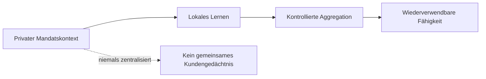
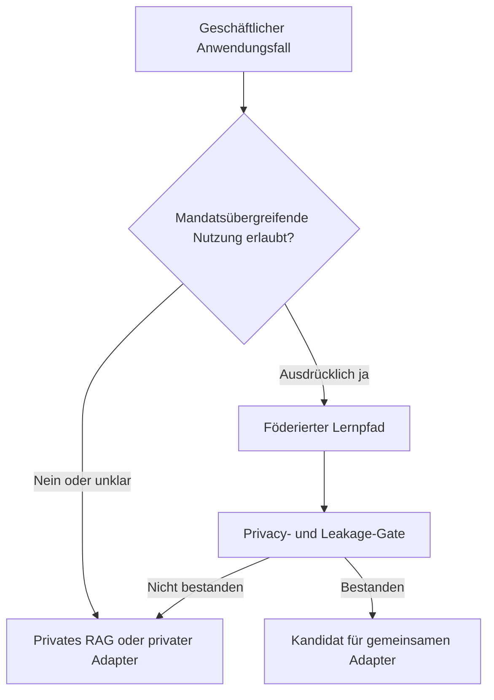

# Föderierte Wissensarchitektur für Strategieberatung

[Überblick](README.md) · [Architektur](../docs/de/architecture.md) · [Deployment](../docs/de/deployment.md) · [Workflow](../docs/de/workflow.md) · [Toolchain](../docs/de/toolchain.md) · [Governance](../docs/de/governance.md) · [English](../README.md)

> Unabhängige explorative Referenzarchitektur. Kein offizielles NVIDIA-Produkt, keine Rechtsberatung, keine Kundenimplementierung und keine Produktionsfreigabe.

**Präsentations-Site:** [ofunk-nvidia.github.io/Federated](https://ofunk-nvidia.github.io/Federated/)

## Die Idee für Executives

Eine Strategieberatung arbeitet gleichzeitig in zahlreichen vertraulichen Kundenmandaten. Jedes Mandat enthält wertvolle Methoden und Erfahrungen. Vertragliche Informationsbarrieren verhindern jedoch, dass Kundenwissen automatisch zu einem gemeinsamen Unternehmensgedächtnis wird.

Das Konzept untersucht, ob wiederverwendbare analytische Fähigkeiten verbessert werden können, ohne Kundendokumente zu zentralisieren oder ein Mandat für ein anderes sichtbar zu machen.

Die Lösung ist nicht „alle Dokumente in ein Modell laden“. Der Ansatz trennt drei Ebenen:

1. ein gemeinsames Basismodell;
2. einen gemeinsamen Adapter, der nur aus ausdrücklich wiederverwendbaren Lernsignalen entsteht;
3. privates Retrieval und private Adapter innerhalb der jeweiligen Mandatsgrenze.

## Warum das relevant ist

| Executive-Frage | Antwort der Architektur |
|---|---|
| Kundenvertraulichkeit | Rohdokumente und private Modellkomponenten bleiben lokal |
| Chinese Walls | Bestehende Identitäten und Berechtigungen bleiben maßgeblich |
| Wiederverwendung von Erfahrung | Nur freigegebene, abstrahierte Lernsignale werden aggregiert |
| Kartell- und Urheberrechtsrisiken | Klassifikation, Mindestkohorten, Privacy Controls, Leakage-Tests und Legal Review |
| Auditierbarkeit | Entscheidungen, Trainingsrunden, Releases und Restrisiken erzeugen Evidenz |

## Kernthese

> Ein Berater darf Wissen innerhalb eines freigegebenen Mandats nutzen. Die Beratung darf dieses Wissen nicht automatisch mandatsübergreifend wiederverwenden.

Federated Learning ist damit ein Mechanismus für Koordination und technische Durchsetzung, keine juristische Abkürzung. [NVIDIA FLARE](https://nvflare.readthedocs.io/en/main/) wird als Orchestrierungsschicht bewertet; lokales Training, Evaluation, Privacy Engineering und Release Governance bleiben getrennte Verantwortlichkeiten. Die [Produkt- und Dienstreferenz](../docs/de/toolchain.md#produkt-und-dienstreferenz) erklärt die genannten Plattform- und Werkzeugkomponenten und verweist auf ihre offizielle Dokumentation.

## Inhalt dieses Repositories

- Referenzarchitektur für getrennte private und wiederverwendbare Wissenspfade;
- Workflow für einen synthetischen POC in einem getrennten privaten Repository;
- Open-Source-orientierte Bewertung der NVIDIA-Toolchain;
- Governance-, Threat-Model- und Release-Gate-Prinzipien;
- GitHub-renderbares Markdown und Mermaid-Visuals.

Nicht enthalten sind Kundenprojekte, Datensätze, Quell-Repositories, Modellgewichte, Adapter, Checkpoints, Produktivkonfigurationen oder Trainingsläufe.

## Entscheidungspfad

## Empfohlene Navigation

1. [Architektur](../docs/de/architecture.md)
2. [Deployment](../docs/de/deployment.md)
3. [Workflow](../docs/de/workflow.md)
4. [Toolchain](../docs/de/toolchain.md)
5. [Governance](../docs/de/governance.md)

## Status

Das Konzept ist für Executive- und technische Gespräche vorbereitet. Es enthält keine Aussage über rechtliche Sicherheit oder Produktionsreife. Der nächste mögliche Umsetzungsschritt ist ein synthetischer Drei-Site-POC in einem getrennten privaten Repository.

