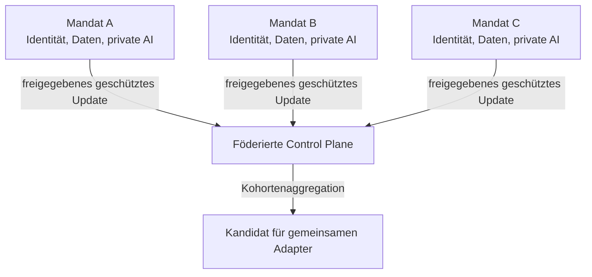
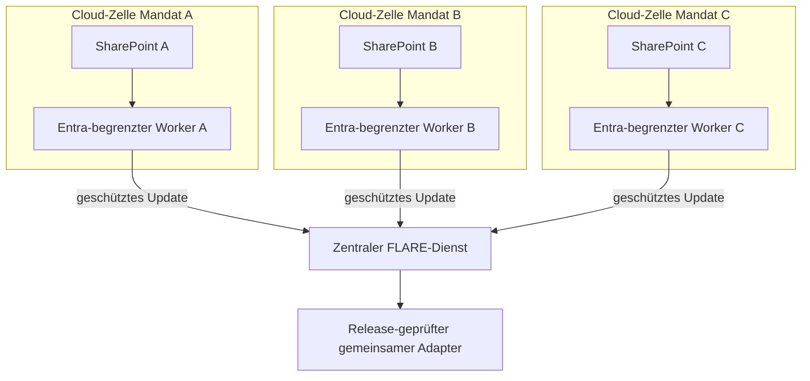

# Architektur

[Überblick](../../de/README.md) · [Architektur](architecture.md) · [Deployment](deployment.md) · [Workflow](workflow.md) · [Toolchain](toolchain.md) · [Governance](governance.md) · [English](../en/architecture.md)

## Entwurfsziel

Jede Mandatsgrenze bleibt erhalten, während ausschließlich eine separat freigegebene gemeinsame Fähigkeit entsteht. [SharePoint](https://learn.microsoft.com/en-us/sharepoint/introduction), [Microsoft Entra ID](https://learn.microsoft.com/en-us/entra/fundamentals/what-is-entra) und [Microsoft Purview Information Barriers](https://learn.microsoft.com/en-us/purview/information-barriers-sharepoint) bleiben für Dokumentenzugriffe maßgeblich. [NVIDIA FLARE](https://nvflare.readthedocs.io/en/main/) steuert, welche lokalen Lernupdates in die Aggregation gelangen dürfen. Rollen, Grenzen und weitere offizielle Dokumentation stehen in der [Produkt- und Dienstreferenz](toolchain.md#produkt-und-dienstreferenz).

## Wissensebenen

| Ebene | Zweck | Ort | Übertragbar? |
|---|---|---|---:|
| Basismodell | allgemeine Sprach- und Reasoning-Fähigkeit | identische Bereitstellung je Site | nur Version |
| Privates RAG | aktuelle Mandatsfakten und Evidenz | Mandatsgrenze | nein |
| Privater Adapter | mandatsspezifisches Verhalten, sofern begründet | Mandatsgrenze | nein |
| Föderierter Adapter | ausdrücklich wiederverwendbare abstrakte Fähigkeit | lokales Training, geschützte Aggregation | nur über Release-Pfad |
| Freigegebener gemeinsamer Adapter | geprüfte gemeinsame Fähigkeit | autorisierte Sites | ja, nach Gate |

## Physische Bereitstellung: zentral gehostete, getrennte Mandatszellen

Dieser Use Case nimmt an, dass die autorisierte Quellenlandschaft zentral im Microsoft-365-Tenant der Strategieberatung liegt. Kunden sind weder getrennte Identity Provider noch FLARE-Sites. Jedes Mandat erhält innerhalb der von der Beratung kontrollierten Cloud eine eigene isolierte Runtime, Workload Identity, Speicher, Schlüssel, Logs und einen FLARE-Client. Der zentrale FLARE-Dienst koordiniert Jobs und aggregiert freigegebene Updates; er erhält weder SharePoint-Dokumente noch Retrieval-Indizes.

Eine Mandatszelle ist eine Sicherheitsgrenze und nicht nur ein logisches Tenant-Label. Getrennte Subscriptions oder Resource Groups sind nützliche Betriebscontainer; die Isolation muss letztlich durch Identitäts-, Netzwerk-, Kryptografie-, Speicher- und Policy-Kontrollen erzwungen werden.

## Microsoft-365-Datenzugriffsebene

| Ebene | Referenzkontrolle | Wichtige Begrenzung |
|---|---|---|
| Entra ID | eine dedizierte Anwendung oder Workload Identity je Mandat; Zertifikat oder föderierte Credential; kein Shared Secret im Code | Identitätstrennung allein gewährt oder entzieht keine SharePoint-Rechte |
| Microsoft Graph | read-only `Sites.Selected` oder, wo praktikabel, der engere Selected-Scope für Liste/Datei; ausdrückliche Zuweisung zur Mandatsressource | tenantweites `Sites.Read.All` liegt außerhalb dieses Entwurfs |
| SharePoint | bestehende Site-, Bibliotheks- und Item-Berechtigungen sowie Aufbewahrungs- und Sensitivity-Metadaten bleiben maßgeblich | der Ingestion-Worker darf Zugriff nie erweitern oder ein Schatten-Berechtigungsmodell schaffen |
| Purview Information Barriers | Site und menschliches Team dem Mandatssegment zuordnen und Audit-Evidenz aufbewahren | App-only-Zugriff separat prüfen; Microsoft dokumentiert einen optionalen App-Bypass, daher ist IB allein keine Applikationsgrenze |
| Lokale Verarbeitung | kurzlebiges verschlüsseltes Staging, Klassifikation, Retrieval sowie private und föderierbare Anpassung innerhalb der Zelle | Rohdokumente, Chunks, Embeddings, Prompts und private Adapter gelangen nicht in den FLARE-Kanal |

Microsoft dokumentiert, dass Selected Permissions sowohl Entra Consent als auch eine ausdrückliche Zuweisung zur ausgewählten SharePoint-Ressource erfordern. Ebenso dokumentiert Microsoft das Verhalten von Explicit-Information-Barrier-Sites und die besondere Behandlung von App-only-Zugriff. Siehe [Selected Permissions](https://learn.microsoft.com/en-us/graph/permissions-selected-overview) und [Information Barriers mit SharePoint](https://learn.microsoft.com/en-us/purview/information-barriers-sharepoint).

## Netzwerk- und Federation-Ebene

Dieser Referenzentwurf ist Hub-and-Spoke und nicht Peer-to-Peer. FLARE-Clients verbinden sich mit dem zentralen Server; direkte Ad-hoc-Verbindungen zwischen Clients bleiben deaktiviert. NVIDIA dokumentiert serververbundene Client Cells als Backbone-Topologie und direkte Ad-hoc-Verbindungen als optionale, standardmäßig deaktivierte Funktion. Siehe [FLARE Communication Configuration](https://nvflare.readthedocs.io/en/main/user_guide/admin_guide/configurations/communication_configuration.html).

| Zone | Zulässiger Datenfluss | Standardmäßig verweigert |
|---|---|---|
| Mandatszelle zu Microsoft 365 | authentifizierte Leseaufrufe auf die zugewiesenen Graph-/SharePoint-Ressourcen | andere Sites, tenantweite Auflistung, anonymer Download |
| Mandatszelle zu FLARE | ausgehende authentifizierte und verschlüsselte Session zu festen zentralen Endpunkten | eingehende Administration vom Aggregator und Client-zu-Client-Routen |
| FLARE-Aggregationszone | freigegebene Jobpakete, geschützte Updates, aggregierte Metriken und signierte Release-Kandidaten | SharePoint-Tokens, Rohinhalte, Retrieval Stores und Offenlegung einzelner Clients |
| Betriebsebene | Health-, Versions-, Policy-Entscheidungs- und Audit-Events mit inhaltsfreien Feldern | Prompts, Dateinamen, Codenamen, Dokumenttext und nach Möglichkeit Kunden-Identifier |

Private Konnektivität, ein kontrollierter Egress Proxy oder eng zugelassene öffentliche Endpunkte können die Route passend zur gewählten Cloud umsetzen. Konkrete Endpunkte, Ports, DNS, Zertifikatslebenszyklus, Update-Schutz und Recovery-Verhalten sind POC-Entscheidungen und vor dem Deployment per Threat Model zu prüfen.

## Audit-Evidenz je Trainingsrunde

- unveränderliche Identitäten von Job, Basismodell, Adapterschema, Sites und Freigebenden;
- Hashes und Signaturen für Code, Konfiguration, Container-Images und freigegebenen Adapter;
- lokaler Nachweis von Quellenklassifikation und Zugriffsentscheidung ohne Export des Quellinhalts;
- zentraler Nachweis von Kohortenschwelle, Privacy-Parametern, Aggregation, Tests und Release-Entscheidung;
- über nicht kundensensitive Run-IDs korrelierte Entra-, SharePoint-/Purview-, Netzwerk-, FLARE- und Artefakt-Registry-Logs;
- Aufbewahrungs-, Widerrufs-, Incident- und Reproduzierbarkeitsnachweise.

## Vertrauensgrenzen

- eine Workload Identity und Runtime pro Mandat;
- keine zentrale Identität mit breitem Zugriff auf alle Mandats-Sites;
- getrennte Speicher für private und föderierbare Beispiele;
- Allowlist für Jobs und Adapterparameter;
- Zielzustand ohne Klartextzugriff auf individuelle Updates;
- Mindestkohorte, Clipping, Privacy Controls, Anomalieerkennung und signierte Releases;
- möglichst inhaltsfreie zentrale Telemetrie.

## Fehlermodell

Die Architektur nimmt an, dass Client, Job, Aggregator, Administrator oder Modell ausfallen oder kompromittiert werden können. Die Kontrollen sind geschichtet, weil Verschlüsselung, Differential Privacy, Informationsbarrieren und Verträge unterschiedliche Problemteile adressieren.

## Offene Architekturentscheidung

Die zentrale Frage ist nicht, ob Federation technisch möglich ist. Entscheidend ist, welches Lernobjekt abstrakt, autorisiert, nützlich und leakage-resistent genug ist, um eine Mandatsgrenze zu überschreiten.

