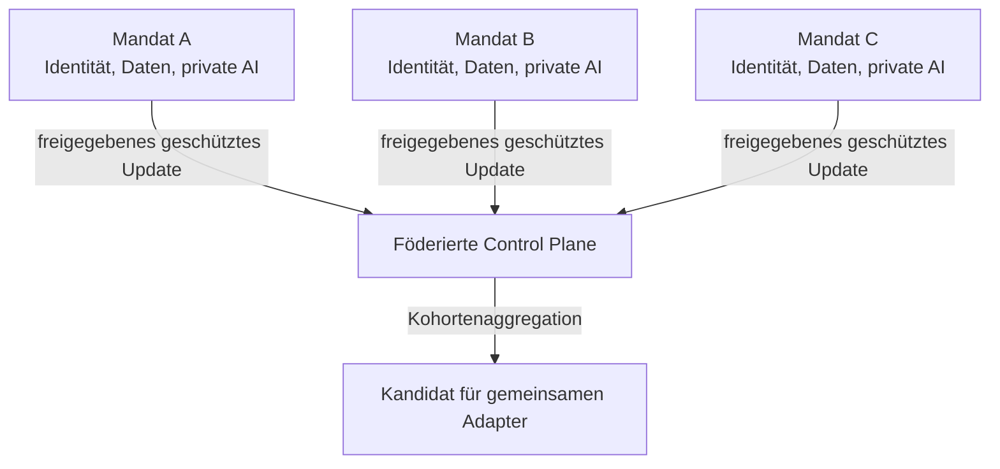

# Architektur

[Überblick](../../de/README.md) · [Architektur](architecture.md) · [Workflow](workflow.md) · [Toolchain](toolchain.md) · [Governance](governance.md) · [English](../en/architecture.md)

## Entwurfsziel

Jede Mandatsgrenze bleibt erhalten, während ausschließlich eine separat freigegebene gemeinsame Fähigkeit entsteht. SharePoint, Entra ID und Purview bleiben für Dokumentenzugriffe maßgeblich. NVIDIA FLARE steuert, welche lokalen Lernupdates in die Aggregation gelangen dürfen.

## Wissensebenen

| Ebene | Zweck | Ort | Übertragbar? |
|---|---|---|---:|
| Basismodell | allgemeine Sprach- und Reasoning-Fähigkeit | identische Bereitstellung je Site | nur Version |
| Privates RAG | aktuelle Mandatsfakten und Evidenz | Mandatsgrenze | nein |
| Privater Adapter | mandatsspezifisches Verhalten, sofern begründet | Mandatsgrenze | nein |
| Föderierter Adapter | ausdrücklich wiederverwendbare abstrakte Fähigkeit | lokales Training, geschützte Aggregation | nur über Release-Pfad |
| Freigegebener gemeinsamer Adapter | geprüfte gemeinsame Fähigkeit | autorisierte Sites | ja, nach Gate |

## Vertrauensgrenzen

- eine Workload Identity und Runtime pro Mandat;
- keine zentrale Identität mit breitem Zugriff auf alle Mandats-Sites;
- getrennte Speicher für private und föderierbare Beispiele;
- Allowlist für Jobs und Adapterparameter;
- Zielzustand ohne Klartextzugriff auf individuelle Updates;
- Mindestkohorte, Clipping, Privacy Controls, Anomalieerkennung und signierte Releases;
- möglichst inhaltsfreie zentrale Telemetrie.

## Fehlermodell

Die Architektur nimmt an, dass Client, Job, Aggregator, Administrator oder Modell ausfallen oder kompromittiert werden können. Die Kontrollen sind geschichtet, weil Verschlüsselung, Differential Privacy, Informationsbarrieren und Verträge unterschiedliche Problemteile adressieren.

## Offene Architekturentscheidung

Die zentrale Frage ist nicht, ob Federation technisch möglich ist. Entscheidend ist, welches Lernobjekt abstrakt, autorisiert, nützlich und leakage-resistent genug ist, um eine Mandatsgrenze zu überschreiten.
