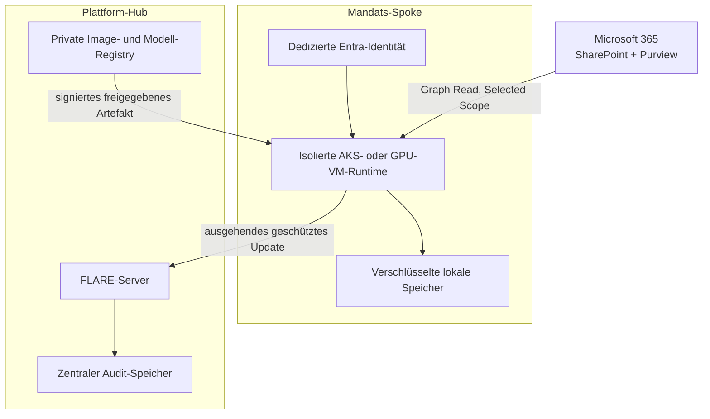

# Deployment-Design

[Überblick](../../de/README.md) · [Architektur](architecture.md) · [Deployment](deployment.md) · [Workflow](workflow.md) · [Toolchain](toolchain.md) · [Governance](governance.md) · [English](../en/deployment.md)

## Status und Umfang

Dies ist ein prüfbarer Low-Level-Referenzentwurf und keine Produktivkonfiguration. Er übersetzt die logische Architektur in konkrete Komponenten-, Identitäts-, Netzwerk-, Sizing-, Betriebs- und Evidenzentscheidungen für einen synthetischen POC mit drei Zellen und einen möglichen Produktivdienst mit zwanzig Zellen. Exakte SKUs, Regionen, Endpunkte und FLARE-Einstellungen benötigen Benchmarks und formale Freigabe in einem getrennten privaten Implementierungs-Repository.

## Empfohlene Azure-Topologie

Dies ist eine zentral betriebene Unternehmensumgebung: Die Strategieberatung besitzt den Microsoft-365-Tenant, den Entra-Tenant und die Azure-Plattform. Kunden stellen keine Identity Federation bereit und sind keine FLARE-Teilnehmer. Ihre Mandatsinhalte werden zentral gehalten, dürfen aber zwischen Mandatsteams nicht geteilt werden.

Für den zentralen Dienst wird eine eigene Plattform-Subscription und für jede Mandatszelle ein dediziertes Spoke-VNet innerhalb der von der Beratung kontrollierten Azure-Landschaft verwendet. Alle Workload Identities gehören zum Entra-Tenant der Beratung, erhalten aber jeweils unabhängig nur Zugriff auf ihre ausgewählte SharePoint-Ressource. Im synthetischen POC kann ein AKS-Cluster drei stark getrennte Namespaces aufnehmen, weil Kundenmaterial ausgeschlossen ist. Für produktive Mandatsdaten ist ein dedizierter AKS-Cluster oder eine gehärtete GPU-VM beziehungsweise VM Scale Set je Mandats-Spoke das Referenzziel; Namespace-Isolation allein ist keine Informationsbarriere.

Der zentrale FLARE-Endpunkt wird privat über einen internen Load Balancer und bei subscriptionsübergreifender Konnektivität gegebenenfalls über einen Azure Private Link Service bereitgestellt. Peering ist nur zulässig, wenn Routingtabellen und Netzwerksicherheitsregeln Spoke-zu-Spoke-Pfade verhindern. Das öffentliche Dokumentations-Repository deployt diese Infrastruktur niemals.

## Komponentenzuordnung

| Grenze | Komponente | Verantwortung | Datenklasse |
|---|---|---|---|
| Microsoft 365 | SharePoint Online | maßgebliche Dokumente, ACLs, Versionen und Aufbewahrung | Mandatsinhalt |
| Microsoft 365 | Entra ID | Workload Identity und Tokenausstellung | Identitätsmetadaten |
| Microsoft 365 | Purview Information Barriers | menschliche Kollaborationsgrenze und Audit-Events | Segmentmetadaten |
| Mandats-Spoke | AKS-Workload oder gehärtete GPU-VM | Ingestion, Klassifikation, Retrieval, Evaluation und lokales Training | Mandatsinhalt und abgeleitete Daten |
| Mandats-Spoke | verschlüsseltes Object Volume | kurzlebiger Quell-Snapshot und freigegebener Trainingsausschnitt | Mandatsinhalt |
| Mandats-Spoke | PostgreSQL/pgvector oder gleichwertiger freigegebener OSS-Store | lokaler Retrieval-Index, Metadaten und Evidenzverweise | private abgeleitete Daten |
| Mandats-Spoke | FLARE-Client und Egress Gateway | Jobdurchsetzung, Update-Filterung und Federation Transport | nur freigegebenes Lernsignal |
| Plattform-Hub | FLARE-Server | Scheduling und Kohortenaggregation | geschützte Updates und aggregierter Zustand |
| Plattform-Hub | private OCI-Registry | signierte Parent- und Job-Images | freigegebene Softwareartefakte |
| Plattform-Hub | Modell-Registry/Object Store | Basismodellmanifest und release-geprüfte gemeinsame Adapter | freigegebene gemeinsame Artefakte |
| Plattform-Hub | Append-only-Auditziel | zentrale Run-, Freigabe-, Aggregations- und Release-Evidenz | inhaltsfreie Betriebsevidenz |

Azure-Dienste in dieser Zuordnung sind Plattformabhängigkeiten und keine Erweiterung der strikten Open-Source-AI-Tool-Baseline. Der Anwendungs-Workload soll portabel bleiben und, wo praktikabel, offene Schnittstellen verwenden.

## Identitätsdomäne und Mandatstrennung

| Frage | Designentscheidung |
|---|---|
| Wem gehört die Identitätsdomäne? | die Strategieberatung betreibt einen zentralen Entra-Tenant |
| Werden Kunden-IdPs föderiert? | nein; Kunden sind in diesem Use Case Data Subjects beziehungsweise Vertragsparteien und keine technischen Federation Sites |
| Wie werden Menschen getrennt? | Mandatsgruppen, SharePoint ACLs, Purview-Segmente, Conditional Access und regelmäßiges Access Review |
| Wie werden Maschinen getrennt? | eine nicht wiederverwendbare Workload Identity je Mandat mit ausdrücklicher Selected-Ressourcenzuweisung |
| Wo findet das Lernen statt? | in von der Beratung betriebenen Runtimes, deren Zugriff auf genau eine Mandatszelle beschränkt ist |
| Was wird föderiert? | nur freigegebene Lernsignale zwischen intern getrennten Mandatszellen; niemals SharePoint-Inhalte oder Zugriffstokens |

Die zentrale Ablage der Quellenlandschaft macht sie nicht zu einem gemeinsamen Korpus. Storage-Eigentum, Leseberechtigung in einem Mandat und Erlaubnis zur mandatübergreifenden Wiederverwendung sind drei getrennte Entscheidungen.

## Identitäts- und Schlüsseldesign

| Credential | Umfang und Inhaber | Speicherung | Rotation und Widerruf |
|---|---|---|---|
| Entra Workload Identity | eine Identität je Mandat, nur ausgewählte Leseberechtigung | föderierter Kubernetes Service Account oder Managed Identity; kein Secret im Image | Service Principal deaktivieren und Ressourcenzuweisung unabhängig entfernen |
| FLARE-Site-Zertifikat | eindeutiger Site-Name und Organisation | site-eigener Key-Vault-/HSM-gestützter Secret Mount, soweit unterstützt | kurzlebige Betriebs-Policy; Kit nach Kompromittierung neu provisionieren |
| FLARE Root CA | Federation Trust Anchor | offline oder in stark kontrollierter Plattform-Sicherheitsgrenze | dokumentierte Zeremonie; neues Trust Bundle über freigegebenen Kanal verteilen |
| Image-Signing-Identität | ausschließlich CI-Release-Dienst | geschützter Signing Service | Signer widerrufen und Digest in Admission Policy sperren |
| Storage-Verschlüsselungsschlüssel | je Mandatszelle ein Customer-Managed Key, sofern erforderlich | Mandats-Key-Vault | rotieren, ohne Plattformbetreibern Dokumentzugriff zu geben |

Microsoft-Graph-Zugriff benötigt sowohl die Selected Application Permission als auch eine ausdrückliche Zuweisung zur ausgewählten Ressource. Zu bevorzugen sind der engste praktikable Selected Scope und die Read-Rolle. Information Barriers bleiben für Personen und Site-Mitgliedschaft relevant; App-only-Zugriff wird separat geprüft, weil Microsoft einen optionalen App-Bypass dokumentiert. Siehe [Selected Permissions](https://learn.microsoft.com/en-us/graph/permissions-selected-overview) und [Information Barriers mit SharePoint](https://learn.microsoft.com/en-us/purview/information-barriers-sharepoint).

## Netzwerk-Policy und Ports

Alle Regeln sind quell- und zielspezifisch. `Any/Any`-Egress, Spoke-zu-Spoke-Routen, eingehende zentrale Administration und direkte FLARE-Ad-hoc-Verbindungen werden verweigert.

| Quelle | Ziel | Protokoll/Port | Zweck |
|---|---|---:|---|
| Mandats-Runtime | Enterprise DNS | UDP/TCP 53 | freigegebene Namensauflösung |
| Mandats-Runtime | Enterprise-Zeitquelle | UDP 123 | Zeitstempel und Zertifikatsgültigkeit |
| Mandats-Runtime | Entra-Tokenendpunkte | TCP 443 | Workload-Tokenbezug |
| Mandats-Runtime | Microsoft-Graph-/SharePoint-Endpunkte | TCP 443 | ausgewählte read-only Ingestion |
| Mandats-Runtime | private Registry/Modell-Mirror | TCP 443 | per Digest fixierte freigegebene Artefakte |
| FLARE-Client | zentraler FLARE-Parent-Endpunkt | fixer provisionierter TCP-Port, POC-Kandidat 8002 | authentifizierte Federation Session |
| Operations Runner | FLARE-Administrationsendpunkt | separat provisionierter fixer TCP-Port, POC-Kandidat 8003 | eingeschränkter Jobbetrieb |
| Mandats-Runtime | Monitoring Collector | TCP 443 oder freigegebener Collector-Port | inhaltsfreie Security- und Health-Events |

Die finalen FLARE-Ports und Hostnamen werden bei der Provisionierung gesetzt und müssen zu Zertifikaten, DNS, Load Balancer und Firewall passen. NVIDIA verlangt korrekte Auflösung des provisionierten Hostnamens und Erreichbarkeit des FLARE-Serverports. Direkte Ad-hoc-Verbindungen bleiben deaktiviert. Siehe [FLARE Deployment](https://nvflare.readthedocs.io/en/main/user_guide/admin_guide/deployment/overview.html) und [Communication Configuration](https://nvflare.readthedocs.io/en/main/user_guide/admin_guide/configurations/communication_configuration.html).

## Workload-Paketierung und Policy

- getrennte, per Digest fixierte Parent- und Job-Images pflegen;
- je Teilnehmer ein signiertes FLARE Startup Kit erzeugen und niemals einen privaten Site-Schlüssel in eine andere Zelle kopieren;
- Produktiv-Workloads vorinstallieren und dynamische Bring-Your-Own-Code-Übertragung deaktivieren;
- freigegebene lokale Datensätze read-only in Jobcontainer mounten;
- Site Policy vor Jobannahme und vor Ergebnisexport durchsetzen;
- ausschließlich deklarierte Adapter-Tensoren, aggregierte Metriken und Evidenzmanifest exportieren;
- abgelehnte Jobs und Updates quarantänisieren, ohne deren Inhalte weiterzuleiten;
- gemeinsame Adapter-Releases signieren und per Digest statt über veränderliche Tags verteilen.

FLARE dokumentiert signierte Startup Kits, site-eigene Policies, read-only Dataset Mounts sowie getrennte Parent-/Job-Containerrollen. Siehe [Deployment Overview](https://nvflare.readthedocs.io/en/main/user_guide/admin_guide/deployment/overview.html), [Container Deployment](https://nvflare.readthedocs.io/en/main/user_guide/admin_guide/deployment/containerized_deployment.html) und [FLARE Security](https://nvidia.github.io/NVFlare/security/).

## Erste Sizing-Profile

Dies sind Budgetrahmen und keine Leistungszusagen.

| Profil | Mandatszelle | Zentraler Dienst | Zu erbringender Nachweis |
|---|---|---|---|
| Discovery | 8–16 vCPU, 32–64 GB RAM, 0,5–1 TB verschlüsselte SSD, keine GPU | 8 vCPU, 32 GB RAM | Graph-Zugriff, Klassifikation, RAG und Evidenzfluss |
| LoRA-POC | 16–32 vCPU, 128–256 GB RAM, 1 GPU mit 48–80 GB VRAM, 2 TB NVMe | 16 vCPU, 64 GB RAM, 1 TB SSD | Adaptertraining der 7B–14B-Klasse und Aggregation über drei Sites |
| Produktionskandidat | 32–64 vCPU, 256–512 GB RAM, 1–4 freigegebene GPUs, 2–8 TB NVMe | 16–32 vCPU, 64–128 GB RAM, resilienter disk-backed Workspace | bis zu zwanzig Sites, parallele Jobs und kontrollierte Evaluation |

Modellgröße, Sequenzlänge, Quantisierung, Batchgröße, Adapterrang, Privacy-Mechanismus, Updatefrequenz und Parallelität bestimmen den tatsächlichen Bedarf. Gemessene Spitzenwerte für VRAM, RAM, temporären Speicher, Netzwerkvolumen und Rundendauer werden vor der SKU-Auswahl dokumentiert.

## Verfügbarkeit und Recovery

Der POC verwendet einen zentralen FLARE-Server und reproduzierbare, wegwerfbare Client-Runtimes. Ein Produktivdesign muss das vom fixierten FLARE-Release unterstützte Hochverfügbarkeitsmuster validieren; zusätzliche generische Kubernetes-Replikate eines zustandsbehafteten Koordinators gelten nicht automatisch als sicher. Gesichert werden Konfiguration, signierte Manifeste, Audit Records und freigegebene Adapter, aber keine temporären SharePoint-Inhalte. Recovery Point und Recovery Time Objectives werden für Orchestrierung, Evidenz und lokales Retrieval getrennt definiert.

Jeder Recovery-Test muss nachweisen, dass eine Ersatzzelle nur ihre eigene Identität, Berechtigungen, Schlüssel und lokalen Zustände erhält, veraltete Updates nicht in spätere Runden gelangen und widerrufene Sites keine neue Verbindung herstellen können.

## Betriebsrollen

| Rolle | Darf | Darf nicht |
|---|---|---|
| Mandats-Data-Owner | Quellen, Zweck, Aufbewahrung und lokale Outputs freigeben | ein anderes Mandat freigeben |
| Mandats-Site-Operator | lokale Runtime, Mappings und Site Policy betreiben | eine andere Site prüfen oder Exportfilter schwächen |
| Federation Operator | freigegebene Jobs planen und aggregierten Zustand beobachten | SharePoint, lokale Indizes oder individuelle Klartextupdates einsehen |
| Model-Risk-Reviewer | Evaluation, Privacy Budget und Release freigeben | Quellenrechte oder Mandatsfreigabe umgehen |
| Platform Security | CA-, Signing-, Vulnerability- und Incident-Kontrollen verwalten | Sicherheitsadministration zur Nutzung von Kundeninhalten einsetzen |
| Auditor | Manifeste, Logs und Freigaben prüfen | unnötigen Quellinhalt erhalten |

## Erforderliches Evidenzpaket

Je Runde werden aufbewahrt: Architekturversion, Data-Purpose-Freigabe, Ressourcenzuweisungen, Site- und Jobidentitäten, Image- und Modelldigests, SBOM und Vulnerability-Entscheidung, Policy-Version, Kohortenmitgliedschaft, Privacy-Parameter, Update-Hashes, aggregierte Metriken, Leakage-Tests, Freigebende, Release-Signatur, Deploymentstatus, Aufbewahrungsfrist und Incident-Verweise.

## Implementierungsfolge und Abnahme

1. Drei synthetische SharePoint-Sites und drei synthetische Entra-Identitäten erstellen.
2. Verweigerung von Cross-Site-Zugriff und Verhalten der App-only-Grenze nachweisen.
3. Drei isolierte Runtimes und einen zentralen FLARE-Dienst mit festen ausgehenden Routen deployen.
4. Einen signierten, vorinstallierten No-Data-Health-Job ausführen und korrelierte Evidenz erfassen.
5. Synthetische LoRA-Federation mit Canary Secrets und Mindestkohorte ausführen.
6. Bösartige Jobs sowie Update-Isolation, Routing, Identität und Memorisation testen.
7. Ressourcen, Update-Schutz und Recovery benchmarken.
8. Vor einem echten Mandatspiloten ein Risk-Acceptance-Dossier erstellen.

Die Abnahme verlangt null Cross-Site-Lesezugriffe, keine rohen oder abgeleiteten privaten Inhalte im Hub, keine direkten Site-Routen, reproduzierbare signierte Releases, erfolgreichen Widerruf und Recovery sowie dokumentiertes verbleibendes Privacy Leakage. Rechtliche und vertragliche Erlaubnis bleibt ein getrenntes Gate.
