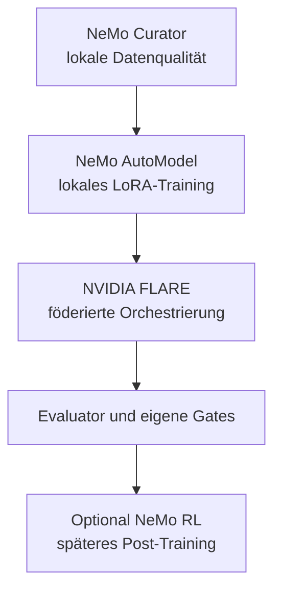

# Toolchain

[Überblick](../../de/README.md) · [Architektur](architecture.md) · [Deployment](deployment.md) · [Workflow](workflow.md) · [Toolchain](toolchain.md) · [Governance](governance.md) · [English](../en/toolchain.md)

## Empfohlener Open-Source-orientierter Stack

| Ebene | Kandidat | Rolle | Einordnung |
|---|---|---|---|
| Datenaufbereitung | NeMo Curator | lokale Filterung, Deduplizierung, Decontamination | gezielter Einsatz |
| Fine-Tuning | NeMo AutoModel | lokales SFT und LoRA/PEFT | bevorzugte Trainingsschicht |
| Federation | NVIDIA FLARE | Orchestrierung, Policy, geschützte Aggregation | föderierte Kernschicht |
| Evaluation | NeMo Evaluator plus eigene Tests | reproduzierbare Modellevaluation | Rahmen, nicht alleinige Autorität |
| Post-Training | NeMo RL | Preference Learning oder RL | später, nach belastbarem Feedback |
| Skalierung | NeMo Framework / Megatron Core | großes oder verteiltes Training | nur bei gemessenem Bedarf |
| Inferenz | TensorRT-LLM | optionale lokale Optimierung | nach Modellvalidierung |

Vor einer Implementierung sind konkretes Release, Repository-Lizenz, enthaltene Abhängigkeiten, Container-Bedingungen und Modelllizenz zu prüfen. Siehe [Open-Source-Werkzeugbasis](../../de/OPEN_SOURCE_BASELINE.md).

NVIDIA NIM und NeMo Microservices gehören nicht zur strikten Open-Source-Baseline. Sie können als Produktoptionen verglichen werden, benötigen aber eine getrennte kommerzielle und rechtliche Entscheidung.

## Verantwortungsverteilung

## Auswahlprinzip

Der Stack ist modular. NVIDIA FLARE entscheidet nicht über Datenrechte und ersetzt nicht den lokalen Trainer. NeMo-Werkzeuge ersetzen weder Mandatsberechtigungen noch unabhängige rechtliche Prüfung oder Leakage-Tests. Jede Komponente muss ihren Nutzen in einem messbaren POC belegen.
