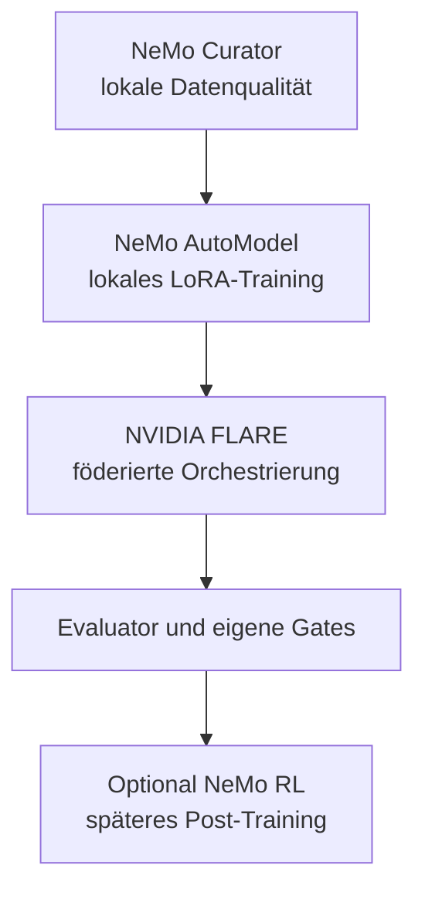

# Toolchain

[Überblick](../../de/README.md) · [Architektur](architecture.md) · [Deployment](deployment.md) · [Workflow](workflow.md) · [Toolchain](toolchain.md) · [Governance](governance.md) · [English](../en/toolchain.md)

## Empfohlener Open-Source-orientierter Stack

| Ebene | Kandidat | Rolle | Einordnung |
|---|---|---|---|
| Datenaufbereitung | [NeMo Curator](https://docs.nvidia.com/nemo/curator/latest/) | lokale Filterung, Deduplizierung, Decontamination | gezielter Einsatz |
| Fine-Tuning | [NeMo AutoModel](https://docs.nvidia.com/nemo/automodel/latest/) | lokales SFT und LoRA/PEFT | bevorzugte Trainingsschicht |
| Federation | [NVIDIA FLARE](https://nvflare.readthedocs.io/en/main/) | Orchestrierung, Policy, geschützte Aggregation | föderierte Kernschicht |
| Evaluation | [NeMo Evaluator](https://docs.nvidia.com/nemo/evaluator) plus eigene Tests | reproduzierbare Modellevaluation | Rahmen, nicht alleinige Autorität |
| Post-Training | [NeMo RL](https://docs.nvidia.com/nemo/rl/index.html) | Preference Learning oder RL | später, nach belastbarem Feedback |
| Skalierung | [NeMo Framework](https://docs.nvidia.com/nemo-framework/index.html) / [Megatron Core](https://docs.nvidia.com/megatron-core/developer-guide/latest/) | großes oder verteiltes Training | nur bei gemessenem Bedarf |
| Inferenz | [TensorRT-LLM](https://docs.nvidia.com/tensorrt-llm/) | optionale lokale Optimierung | nach Modellvalidierung |

Vor einer Implementierung sind konkretes Release, Repository-Lizenz, enthaltene Abhängigkeiten, Container-Bedingungen und Modelllizenz zu prüfen. Siehe [Open-Source-Werkzeugbasis](../../de/OPEN_SOURCE_BASELINE.md).

[NVIDIA NIM](https://docs.nvidia.com/nim/large-language-models/latest/introduction.html) und [NeMo Microservices](https://docs.nvidia.com/nemo/microservices/latest/) gehören nicht zur strikten Open-Source-Baseline. Sie können als Produktoptionen verglichen werden, benötigen aber eine getrennte kommerzielle und rechtliche Entscheidung.

## Produkt- und Dienstreferenz { #produkt-und-dienstreferenz }

Die folgenden Links führen zu offiziellen Produkt- oder Projektdokumentationen. Die Aufnahme erklärt die Architektur; sie ist keine Freigabe einer Lizenz, Subscription, eines Modells, Deployments oder bestimmten Releases.

### Microsoft- und Cloud-Plattform

| Produkt oder Dienst | Was ist das? | Rolle und Grenze in diesem Entwurf | Offizielle Referenz |
|---|---|---|---|
| Microsoft 365 | Microsofts Cloud-Suite für Produktivität und Zusammenarbeit | Tenant-Grenze der autorisierten Quellenlandschaft | [Microsoft-365-Dokumentation](https://learn.microsoft.com/en-us/microsoft-365/) |
| SharePoint Online | Dokument- und Kollaborationsdienst innerhalb von Microsoft 365 | maßgeblicher Dokumentenspeicher für Berechtigungen, Versionen, Aufbewahrung und Labels | [SharePoint-Einführung](https://learn.microsoft.com/en-us/sharepoint/introduction) |
| Microsoft Entra ID | Cloud-Dienst für Identitäts- und Zugriffsmanagement | authentifiziert Personen und gibt jedem Mandats-Workload eine getrennt kontrollierte Identität | [Was ist Microsoft Entra?](https://learn.microsoft.com/en-us/entra/fundamentals/what-is-entra) |
| Microsoft Graph | REST-API- und SDK-Gateway zu Microsoft-Cloud-Daten | read-only Zugriffspfad zu ausdrücklich zugewiesenen SharePoint-Ressourcen; kein neues Berechtigungssystem | [Microsoft-Graph-Überblick](https://learn.microsoft.com/en-us/graph/overview) |
| Microsoft Purview Information Barriers | Policy-Kontrollen zur Einschränkung von Kommunikation und Zusammenarbeit zwischen definierten Segmenten | unterstützt Personen- und Site-Trennung; App-only-Zugriff benötigt weiterhin eine unabhängige Grenzprüfung | [Information Barriers mit SharePoint](https://learn.microsoft.com/en-us/purview/information-barriers-sharepoint) |
| Microsoft Azure | kommerzielle Cloud-Plattform | hostet isolierte Mandats-Spokes und den zentralen Plattform-Hub; außerhalb der strikten OSS-Baseline | [Azure-Dokumentation](https://learn.microsoft.com/en-us/azure/) |
| Azure Virtual Network | isoliertes softwaredefiniertes Netzwerk in Azure | bildet die jeweilige Hub- oder Spoke-Netzwerkgrenze und transportiert nur ausdrücklich zugelassene Routen | [Virtual-Network-Überblick](https://learn.microsoft.com/en-us/azure/virtual-network/virtual-networks-overview) |
| Azure Kubernetes Service (AKS) | verwalteter Kubernetes-Dienst | mögliche Workload-Runtime; Namespaces allein gelten nicht als produktive Informationsbarriere | [AKS-Überblick](https://learn.microsoft.com/en-us/azure/aks/what-is-aks) |
| Azure Virtual Machines / VM Scale Sets | verwaltete virtuelle Compute-Instanzen und skalierbare Gruppen | alternative gehärtete Runtime, wenn dedizierte Infrastruktur gegenüber AKS bevorzugt wird | [Virtual Machines](https://learn.microsoft.com/en-us/azure/virtual-machines/overview) · [VM Scale Sets](https://learn.microsoft.com/en-us/azure/virtual-machine-scale-sets/overview) |
| Azure Private Link Service | private Anbindung eines Dienstes über Azure Private Endpoints | optionale private Bereitstellung des zentralen FLARE-Endpunkts über Netzwerkgrenzen | [Private-Link-Service-Überblick](https://learn.microsoft.com/en-us/azure/private-link/private-link-service-overview) |
| Azure Key Vault | verwalteter Speicher für Schlüssel, Secrets und Zertifikate | möglicher geschützter Speicher für mandatsbezogene Schlüssel und FLARE-Site-Credentials | [Key-Vault-Überblick](https://learn.microsoft.com/en-us/azure/key-vault/general/overview) |

### Offene Daten- und Paketierungsbausteine

| Komponente | Was ist das? | Rolle und Grenze in diesem Entwurf | Offizielle Referenz |
|---|---|---|---|
| PostgreSQL | relationale Open-Source-Datenbank | optionaler lokaler Metadaten- und Evidenzspeicher innerhalb einer Mandatszelle | [PostgreSQL-Dokumentation](https://www.postgresql.org/docs/) |
| pgvector | Open-Source-Erweiterung für Vektorähnlichkeitssuche in PostgreSQL | optionaler lokaler Retrieval-Index; Vektoren bleiben privat im Mandat | [pgvector-Projekt und Lizenz](https://github.com/pgvector/pgvector) |
| Open Container Initiative (OCI) | offene Spezifikationen für Container-Images, Runtimes und Distribution | Interoperabilitätsbasis der privaten Image-Registry; kein Registry-Produkt | [OCI-Spezifikationen](https://opencontainers.org/) |

### Publikationsschicht

| Produkt | Was ist das? | Verwendung in diesem Repository | Offizielle Referenz |
|---|---|---|---|
| GitHub Pages | statisches Website-Hosting aus einem GitHub-Repository | veröffentlicht die geprüfte Markdown-Präsentation aus dem committed Source | [GitHub-Pages-Dokumentation](https://docs.github.com/en/pages/getting-started-with-github-pages/what-is-github-pages) |
| Material for MkDocs | Open-Source-Dokumentationstheme mit Site-Generator-Integration | rendert die zweisprachige Präsentation; die exakte Abhängigkeit ist in [`requirements-pages.txt`](https://github.com/ofunk-nvidia/Federated/blob/main/requirements-pages.txt) fixiert | [Material-for-MkDocs-Dokumentation](https://squidfunk.github.io/mkdocs-material/) |
| Mermaid | textbasierte Diagrammsyntax mit Renderer | hält Architekturdiagramme in Markdown prüfbar und auf GitHub renderbar | [Mermaid-Dokumentation](https://mermaid.js.org/intro/) |

## Zentrale Begriffe

| Begriff | Bedeutung in diesem Entwurf |
|---|---|
| RAG | Retrieval-Augmented Generation: autorisierte lokale Evidenz wird zur Anfragezeit abgerufen, statt sie in gemeinsame Modellgewichte zu übernehmen |
| SFT | Supervised Fine-Tuning mit geprüften Eingabe-/Ausgabebeispielen |
| LoRA / PEFT | parameter-effiziente Tuning-Verfahren, die einen kleinen Adapter statt aller Basismodellparameter aktualisieren |
| Differential Privacy (DP) | kalibriertes Rauschen und Beitragsbegrenzung zur Reduktion, nicht Beseitigung, des Offenlegungsrisikos |
| HSM | Hardware Security Module zum Schutz kryptografischer Schlüssel und Signaturvorgänge |
| SBOM | Software Bill of Materials mit Komponenten und Versionen für Prüfung und Vulnerability Management |

## Verantwortungsverteilung

## Auswahlprinzip

Der Stack ist modular. NVIDIA FLARE entscheidet nicht über Datenrechte und ersetzt nicht den lokalen Trainer. NeMo-Werkzeuge ersetzen weder Mandatsberechtigungen noch unabhängige rechtliche Prüfung oder Leakage-Tests. Jede Komponente muss ihren Nutzen in einem messbaren POC belegen.
