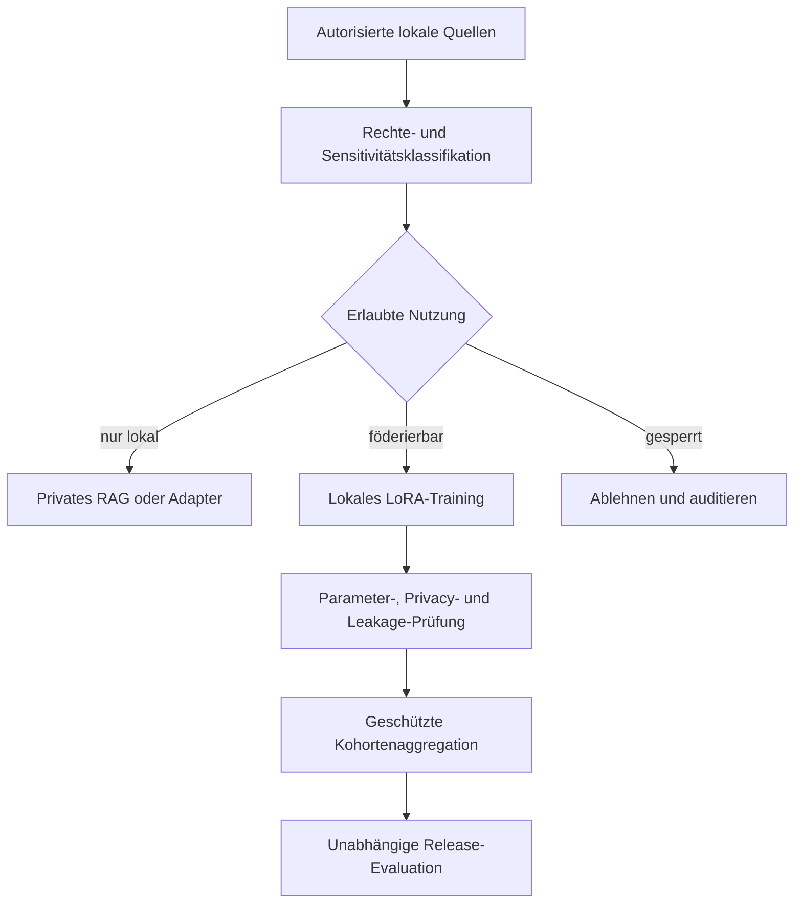

# Workflow

[Überblick](../../de/README.md) · [Architektur](architecture.md) · [Workflow](workflow.md) · [Toolchain](toolchain.md) · [Governance](governance.md) · [English](../en/workflow.md)

## Kontrollierter Lernzyklus

## Reihenfolge des Proof of Concept

| Stufe | Frage | Exit-Evidenz |
|---|---|---|
| 0. Entscheidungen | Was ist erlaubt, nützlich und messbar? | Threat Model, Lizenzen, Owner, Metriken |
| 1. Isolation | Bleiben drei synthetische Sites getrennt? | negative Zugriffstests |
| 2. Lokale Baseline | Liefert lokales RAG oder LoRA Mehrwert? | Vergleich mit eingefrorenem Basismodell |
| 3. Federation | Lassen sich kompatible Adapter aggregieren? | reproduzierbarer Cross-Site-Lauf |
| 4. Privacy | Was kosten Clipping, DP oder geschützte Aggregation? | Utility-/Privacy-Benchmark |
| 5. Red Team | Lassen sich Canaries oder Site-Identität extrahieren? | dokumentierte Angriffsergebnisse |
| 6. Entscheidung | Ist ein Kunden-Lab gerechtfertigt? | Go-, Change- oder Stop-Empfehlung |

## Mindestevidenz für ein Release

- Provenienz und Nutzungsklasse jedes Trainingsbeispiels;
- genaue Modell-, Adapter-, Job-, Policy- und Abhängigkeitsversionen;
- erzwungene Mindestkohorte und Update-Schema-Prüfung;
- Nutzenvergleich mit eingefrorenem Basismodell und Local-only-Alternativen;
- Memorisation-, Extraction-, Membership- und Cross-Engagement-Tests;
- signierte Freigaben und dokumentierte Restrisiken;
- Rückruf-, Widerrufs-, Incident- und Mandatsaustrittsverfahren.

Der hier beschriebene POC ist ausschließlich ein Blueprint. Die Umsetzung gehört in ein getrenntes freigegebenes privates Repository.
