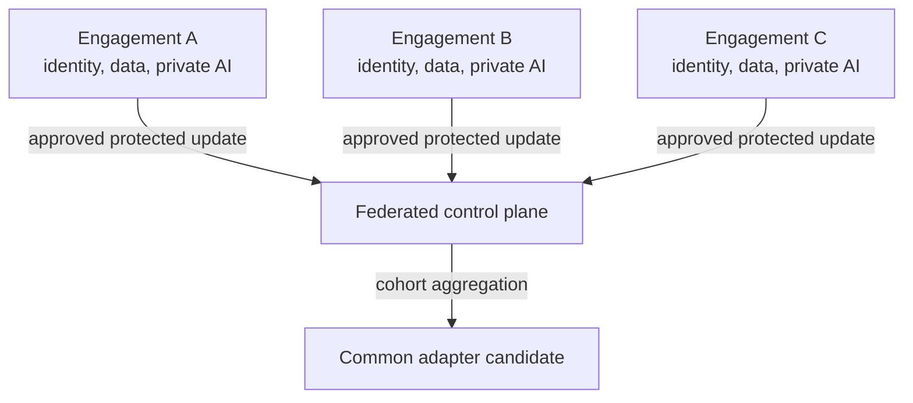
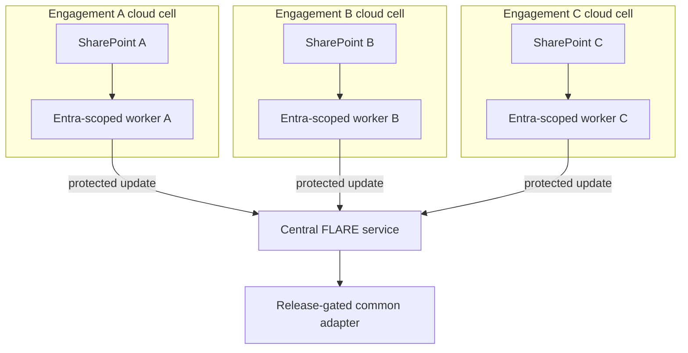

# Architecture

[Overview](../../README.md) · [Architecture](architecture.md) · [Deployment](deployment.md) · [Workflow](workflow.md) · [Toolchain](toolchain.md) · [Governance](governance.md) · [Deutsch](../de/architecture.md)

## Design objective

Preserve every engagement boundary while creating only a separately approved shared capability. [SharePoint](https://learn.microsoft.com/en-us/sharepoint/introduction), [Microsoft Entra ID](https://learn.microsoft.com/en-us/entra/fundamentals/what-is-entra), and [Microsoft Purview Information Barriers](https://learn.microsoft.com/en-us/purview/information-barriers-sharepoint) remain the authority for document access. [NVIDIA FLARE](https://nvflare.readthedocs.io/en/main/) governs which local learning updates may enter aggregation. See the [product and service reference](toolchain.md#product-and-service-reference) for roles, boundaries, and further official documentation.

## Knowledge layers

| Layer | Purpose | Location | Transferable? |
|---|---|---|---:|
| Base model | general language and reasoning capability | identical deployment at every site | version only |
| Private RAG | current engagement facts and evidence | engagement boundary | no |
| Private adapter | engagement-specific behaviour where justified | engagement boundary | no |
| Federated adapter | explicitly reusable abstract capability | local training, protected aggregation | only through release path |
| Released common adapter | approved shared capability | authorised sites | yes, after gate |

## Physical deployment: centrally hosted, separated engagement cells

This use case assumes that the authorised source estate is centrally held in the strategy consultancy's Microsoft 365 tenant. Customers are not separate identity providers or FLARE sites. Each engagement receives its own isolated runtime, workload identity, storage, keys, logs, and FLARE client inside the consultancy-controlled cloud. The central FLARE service coordinates jobs and aggregates approved updates; it receives neither SharePoint documents nor retrieval indexes.

An engagement cell is a security boundary, not just a logical tenant label. Separate subscriptions or resource groups are useful operational containers, but isolation must ultimately be enforced by identity, network, cryptographic, storage, and policy controls.

## Microsoft 365 data-access plane

| Layer | Reference control | Important limitation |
|---|---|---|
| Entra ID | one dedicated application or workload identity per engagement; certificate or federated credential; no shared secret in code | identity separation does not grant or remove SharePoint rights by itself |
| Microsoft Graph | read-only `Sites.Selected`, or the narrower selected list/file scope where practical; explicit assignment to the engagement resource | tenant-wide `Sites.Read.All` is outside this design |
| SharePoint | existing site, library, item permissions, retention, and sensitivity metadata remain authoritative | the ingestion worker must never broaden access or create a shadow permission model |
| Purview Information Barriers | align the site and human team to the engagement segment and retain audit evidence | app-only access needs separate review; Microsoft documents an opt-in app bypass, so IB alone is not an application boundary |
| Local processing | short-lived encrypted staging, classification, retrieval, private adaptation, and federatable adaptation inside the cell | raw documents, chunks, embeddings, prompts, and private adapters do not enter the FLARE channel |

Microsoft documents that Selected permissions require both Entra consent and an explicit assignment to the selected SharePoint resource. It also documents the behavior of Explicit Information Barrier sites and the special treatment of app-only access. See [Selected permissions](https://learn.microsoft.com/en-us/graph/permissions-selected-overview) and [Information Barriers with SharePoint](https://learn.microsoft.com/en-us/purview/information-barriers-sharepoint).

## Network and federation plane

This reference design is hub-and-spoke, not peer-to-peer. FLARE clients connect to the central server; direct ad-hoc client connections remain disabled. NVIDIA documents server-connected client cells as the backbone topology and notes that ad-hoc direct connections are optional and disabled by default. See [FLARE communication configuration](https://nvflare.readthedocs.io/en/main/user_guide/admin_guide/configurations/communication_configuration.html).

| Zone | Permitted flow | Denied by default |
|---|---|---|
| Engagement cell to Microsoft 365 | authenticated read calls to the assigned Graph/SharePoint resources | other sites, tenant-wide enumeration, anonymous download |
| Engagement cell to FLARE | outbound authenticated and encrypted session to fixed central endpoints | inbound administration from the aggregator and client-to-client routes |
| FLARE aggregation zone | approved job packages, protected updates, aggregate metrics, signed release candidates | SharePoint tokens, raw content, retrieval stores, individual client disclosure |
| Operations plane | health, version, policy decision, and audit events with content-free fields | prompts, filenames, code names, document text, customer identifiers where avoidable |

Private connectivity, a controlled egress proxy, or tightly allowlisted public endpoints can implement the route according to the selected cloud. Exact endpoints, ports, DNS, certificate lifecycle, update protection, and recovery behavior are POC decisions and must be threat-modelled before deployment.

## Audit evidence per training round

- immutable identities of the job, base model, adapter schema, sites, and approvers;
- hashes and signatures for code, configuration, container images, and released adapter;
- local proof of source classification and access decision without exporting source content;
- central proof of cohort threshold, privacy parameters, aggregation, tests, and release decision;
- Entra, SharePoint/Purview, network, FLARE, and artefact-registry logs correlated through non-client-sensitive run identifiers;
- retention, revocation, incident, and reproducibility records.

## Trust boundaries

- one workload identity and runtime per engagement;
- no central identity with broad access to all engagement sites;
- separate storage for private and federatable examples;
- allowlisted jobs and adapter parameters;
- no plaintext visibility of individual updates as the target state;
- minimum cohort, clipping, privacy controls, anomaly detection, and signed releases;
- content-free central telemetry wherever possible.

## Failure model

The design assumes that a client, job, aggregator, administrator, or model can fail or be compromised. Controls are layered because encryption, differential privacy, information barriers, and legal agreements solve different parts of the problem.

## Architecture decision still required

The central question is not whether federation is technically possible. It is which learning object is sufficiently abstract, authorised, useful, and leakage-resistant to cross an engagement boundary.

