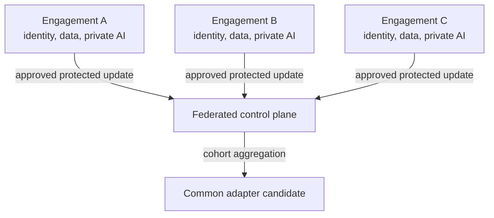

# Architecture

[Overview](../../README.md) · [Architecture](architecture.md) · [Workflow](workflow.md) · [Toolchain](toolchain.md) · [Governance](governance.md) · [Deutsch](../de/architecture.md)

## Design objective

Preserve every engagement boundary while creating only a separately approved shared capability. SharePoint, Entra ID, and Purview remain the authority for document access. NVIDIA FLARE governs which local learning updates may enter aggregation.

## Knowledge layers

| Layer | Purpose | Location | Transferable? |
|---|---|---|---:|
| Base model | general language and reasoning capability | identical deployment at every site | version only |
| Private RAG | current engagement facts and evidence | engagement boundary | no |
| Private adapter | engagement-specific behaviour where justified | engagement boundary | no |
| Federated adapter | explicitly reusable abstract capability | local training, protected aggregation | only through release path |
| Released common adapter | approved shared capability | authorised sites | yes, after gate |

## Trust boundaries

- one workload identity and runtime per engagement;
- no central identity with broad access to all engagement sites;
- separate storage for private and federatable examples;
- allowlisted jobs and adapter parameters;
- no plaintext visibility of individual updates as the target state;
- minimum cohort, clipping, privacy controls, anomaly detection, and signed releases;
- content-free central telemetry wherever possible.

## Failure model

The design assumes that a client, job, aggregator, administrator, or model can fail or be compromised. Controls are layered because encryption, differential privacy, information barriers, and legal agreements solve different parts of the problem.

## Architecture decision still required

The central question is not whether federation is technically possible. It is which learning object is sufficiently abstract, authorised, useful, and leakage-resistant to cross an engagement boundary.
