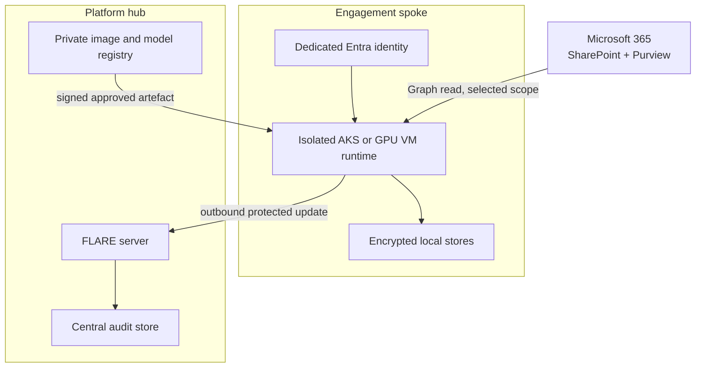

# Deployment design

[Overview](../../README.md) · [Architecture](architecture.md) · [Deployment](deployment.md) · [Workflow](workflow.md) · [Toolchain](toolchain.md) · [Governance](governance.md) · [Deutsch](../de/deployment.md)

## Status and scope

This is a reviewable low-level reference design, not a production configuration. It turns the logical architecture into concrete component, identity, network, sizing, operations, and evidence decisions for a synthetic three-cell POC and a possible twenty-cell production service. Exact SKUs, regions, endpoints, and FLARE settings require benchmarking and formal approval in a separate private implementation repository.

## Recommended Azure topology

This is one centrally operated enterprise environment: the strategy consultancy owns the [Microsoft 365](https://learn.microsoft.com/en-us/microsoft-365/) tenant, [Microsoft Entra ID](https://learn.microsoft.com/en-us/entra/fundamentals/what-is-entra) tenant and [Microsoft Azure](https://learn.microsoft.com/en-us/azure/) platform. Customers do not provide identity federation and are not [NVIDIA FLARE](https://nvflare.readthedocs.io/en/main/) participants. Their engagement material is held centrally but must remain non-shareable across mandate teams.

Use a separate platform subscription for the central service and a dedicated spoke VNet for every engagement cell inside the consultancy-controlled Azure estate. All workload identities belong to the consultancy's Entra tenant, but each is independently permissioned to its selected SharePoint resource. For a synthetic POC, one [Azure Kubernetes Service (AKS)](https://learn.microsoft.com/en-us/azure/aks/what-is-aks) cluster may host three strongly separated namespaces because no client material is permitted. For production engagement data, the reference target is a dedicated AKS cluster or hardened GPU VM/VM scale set per engagement spoke; namespace isolation alone is not the information barrier.

The central FLARE endpoint is exposed privately through an internal load balancer and, where cross-subscription connectivity requires it, an [Azure Private Link Service](https://learn.microsoft.com/en-us/azure/private-link/private-link-service-overview). Peering is acceptable only when routing tables and network security rules prevent spoke-to-spoke paths. The public documentation repository never deploys this infrastructure. See the [product and service reference](toolchain.md#product-and-service-reference) for concise definitions and official sources.

## Component allocation

| Boundary | Component | Responsibility | Data classification |
|---|---|---|---|
| Microsoft 365 | SharePoint Online | authoritative documents, ACLs, versions and retention | engagement content |
| Microsoft 365 | Entra ID | workload identity and token issuance | identity metadata |
| Microsoft 365 | Purview Information Barriers | human collaboration boundary and audit events | segment metadata |
| Engagement spoke | AKS workload or hardened GPU VM | ingestion, classification, retrieval, evaluation and local training | engagement content and derived data |
| Engagement spoke | encrypted object volume | short-lived source snapshot and approved training slice | engagement content |
| Engagement spoke | PostgreSQL/pgvector or equivalent approved OSS store | local retrieval index, metadata and evidence pointers | derived private data |
| Engagement spoke | FLARE client and outbound gateway | job enforcement, update filtering and federation transport | approved learning signal only |
| Platform hub | FLARE server | scheduling and cohort aggregation | protected updates and aggregate state |
| Platform hub | private OCI registry | signed parent and job images | approved software artefacts |
| Platform hub | model registry/object store | base-model manifest and release-gated common adapters | approved shared artefacts |
| Platform hub | append-only audit target | central run, approval, aggregation and release evidence | content-free operational evidence |

Azure services in this mapping are platform dependencies, not additions to the strict open-source AI-tool baseline. The application workload should remain portable and use open interfaces where practical.

## Identity domain and engagement isolation

| Question | Design decision |
|---|---|
| Who owns the identity domain? | the strategy consultancy operates one central Entra tenant |
| Are customer IdPs federated? | no; customers are data subjects/contractual principals, not technical federation sites in this use case |
| How are human users separated? | engagement groups, SharePoint ACLs, Purview segments, conditional access and periodic access review |
| How are machines separated? | one non-reusable workload identity per engagement with explicit Selected resource assignment |
| Where is learning performed? | in consultancy-operated runtimes whose access is restricted to one engagement cell |
| What is federated? | only approved learning signals between internally separated engagement cells; never SharePoint content or access tokens |

The central location of the source estate does not make it a shared corpus. Storage ownership, permission to read in one mandate, and permission to reuse across mandates are three different decisions.

## Identity and key design

| Credential | Scope and holder | Storage | Rotation and revocation |
|---|---|---|---|
| Entra workload identity | one identity per engagement, selected read permission only | federated Kubernetes service account or managed identity; no secret in image | disable service principal and remove resource assignment independently |
| FLARE site certificate | unique site name and organisation | site-owned Key Vault/HSM-backed secret mount where supported | short-lived operational policy; re-provision kit after compromise |
| FLARE root CA | federation trust anchor | offline or tightly controlled platform security boundary | documented ceremony; distribute new trust bundle through approved channel |
| image-signing identity | CI release service only | protected signing service | revoke signer and block digest in admission policy |
| storage encryption key | one customer-managed key per engagement cell where required | engagement Key Vault | rotate without granting platform operators document access |

Microsoft Graph access requires both the Selected application permission and an explicit assignment to the selected resource. Prefer the narrowest practical selected scope and read role. Information Barriers remain valuable for people and site membership, but app-only access is reviewed separately because Microsoft documents an optional app bypass. See [Selected permissions](https://learn.microsoft.com/en-us/graph/permissions-selected-overview) and [Information Barriers with SharePoint](https://learn.microsoft.com/en-us/purview/information-barriers-sharepoint).

## Network policy and ports

All rules are source- and destination-specific. `Any/Any` outbound access, spoke-to-spoke routes, inbound central administration, and direct FLARE ad-hoc connections are denied.

| Source | Destination | Protocol/port | Purpose |
|---|---|---:|---|
| engagement runtime | enterprise DNS | UDP/TCP 53 | approved name resolution |
| engagement runtime | enterprise time source | UDP 123 | timestamp and certificate validity |
| engagement runtime | Entra token endpoints | TCP 443 | workload token acquisition |
| engagement runtime | Microsoft Graph/SharePoint endpoints | TCP 443 | selected read-only ingestion |
| engagement runtime | private registry/model mirror | TCP 443 | digest-pinned approved artefacts |
| FLARE client | central FLARE parent endpoint | fixed provisioned TCP port, POC candidate 8002 | authenticated federation session |
| operations runner | FLARE administration endpoint | separately provisioned fixed TCP port, POC candidate 8003 | restricted job operations |
| engagement runtime | monitoring collector | TCP 443 or approved collector port | content-free security and health events |

The final FLARE ports and hostnames are set during provisioning and must match certificates, DNS, load balancer and firewall configuration. NVIDIA requires the provisioned hostname to resolve correctly and the FLARE server port to be reachable. Direct ad-hoc connections remain disabled. See [FLARE deployment](https://nvflare.readthedocs.io/en/main/user_guide/admin_guide/deployment/overview.html) and [communication configuration](https://nvflare.readthedocs.io/en/main/user_guide/admin_guide/configurations/communication_configuration.html).

## Workload packaging and policy

- maintain separate digest-pinned parent and job images;
- generate one signed FLARE startup kit per participant and never copy a site private key to another cell;
- preinstall production workloads; disable dynamic Bring Your Own Code submission;
- mount approved local datasets read-only into job containers;
- enforce site policy before job acceptance and before result export;
- allow only the declared adapter tensors, aggregate metrics and evidence manifest to leave;
- quarantine rejected jobs and updates without forwarding their contents;
- sign common-adapter releases and distribute by digest, not mutable tag.

FLARE documents signed startup kits, site-owned policies, read-only dataset mounts, and separate parent/job container roles. See [deployment overview](https://nvflare.readthedocs.io/en/main/user_guide/admin_guide/deployment/overview.html), [container deployment](https://nvflare.readthedocs.io/en/main/user_guide/admin_guide/deployment/containerized_deployment.html), and [FLARE security](https://nvidia.github.io/NVFlare/security/).

## Initial sizing profiles

These are budgeting envelopes, not performance commitments.

| Profile | Engagement cell | Central service | Intended proof |
|---|---|---|---|
| discovery | 8–16 vCPU, 32–64 GB RAM, 0.5–1 TB encrypted SSD, no GPU | 8 vCPU, 32 GB RAM | Graph access, classification, RAG and evidence flow |
| LoRA POC | 16–32 vCPU, 128–256 GB RAM, 1 GPU with 48–80 GB VRAM, 2 TB NVMe | 16 vCPU, 64 GB RAM, 1 TB SSD | 7B–14B-class adapter training and three-site aggregation |
| production candidate | 32–64 vCPU, 256–512 GB RAM, 1–4 approved GPUs, 2–8 TB NVMe | 16–32 vCPU, 64–128 GB RAM, resilient disk-backed workspace | up to twenty sites, concurrent jobs and controlled evaluation |

Model size, sequence length, quantisation, batch size, adapter rank, privacy mechanism, update frequency and concurrency determine the real requirement. Record measured peak VRAM, RAM, temporary disk, network volume and round duration before selecting a SKU.

## Availability and recovery

The POC uses one central FLARE server and reproducible, disposable client runtimes. A production design must validate the high-availability pattern supported by the pinned FLARE release; adding generic Kubernetes replicas to a stateful coordinator is not assumed to be safe. Back up configuration, signed manifests, audit records and released adapters, but not temporary SharePoint content. Define recovery point and recovery time objectives separately for orchestration, evidence and local retrieval.

Each recovery test must prove that a replacement cell receives only its own identity, permissions, keys and local state; that stale updates cannot re-enter a later round; and that revoked sites cannot reconnect.

## Operating roles

| Role | May do | Must not do |
|---|---|---|
| engagement data owner | approve sources, purpose, retention and local outputs | approve another engagement |
| engagement site operator | operate local runtime, mappings and site policy | inspect another site or weaken export filters |
| federation operator | schedule approved jobs and observe aggregate health | access SharePoint, local indexes or plaintext individual updates |
| model risk reviewer | approve evaluation, privacy budget and release | bypass source-rights or engagement approval |
| platform security | manage CA, signing, vulnerability and incident controls | use security administration to consume client content |
| auditor | verify manifests, logs and approvals | receive unnecessary source content |

## Required evidence package

For every round retain: architecture version, data-purpose approval, resource assignments, site and job identities, image and model digests, SBOM and vulnerability decision, policy version, cohort membership, privacy parameters, update hashes, aggregate metrics, leakage tests, approvers, release signature, deployment status, retention deadline and incident links.

## Implementation sequence and acceptance

1. Build three synthetic SharePoint sites and three synthetic Entra identities.
2. Prove cross-site access denial and app-only boundary behavior.
3. Deploy three isolated runtimes and one central FLARE service with fixed outbound routes.
4. Run a signed, preinstalled no-data health job and collect correlated evidence.
5. Run synthetic LoRA federation with canary secrets and minimum-cohort enforcement.
6. Attempt malicious job, update isolation, route, identity and memorisation tests.
7. Benchmark resources, update protection and recovery.
8. Produce a risk-acceptance dossier before any real engagement pilot.

Acceptance requires zero cross-site reads, no raw or derived private content at the hub, no direct site routes, reproducible signed releases, successful revocation and recovery, and documented residual privacy leakage. Legal and contractual permission remains a separate gate.
