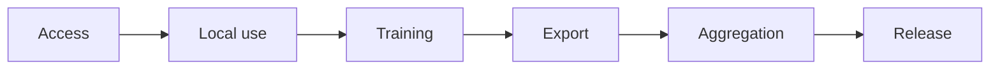

# Governance

[Overview](../../README.md) · [Architecture](architecture.md) · [Workflow](workflow.md) · [Toolchain](toolchain.md) · [Governance](governance.md) · [Deutsch](../de/governance.md)

## Governing principle

Data access, local use, training use, cross-engagement transfer, aggregation, and model release are separate decisions. Permission at one stage does not imply permission at the next.

Each transition requires an explicit policy decision and evidence.

## Information classes

| Class | Typical content | Default treatment |
|---|---|---|
| Public | approved publications and public methods | eligible after rights check |
| Reusable method | explicitly approved abstract methods | federatable after controls |
| Confidential engagement | internal analysis and client processes | local only |
| Highly sensitive | prices, bids, capacity, M&A, strategy, personal data | exclude from federation |
| Unknown | unclear origin, rights, or purpose | deny |

## Release gate

A common adapter is only a release candidate when Legal, Competition/Antitrust, Privacy, Security, model risk, and engagement ownership have reviewed the defined purpose, evidence, attacks, and residual risks.

Technical controls reduce risk; they do not create rights. Model updates may still reveal information. Failure to extract a canary demonstrates only that a defined test failed to extract it, not that leakage is impossible.

## Repository publication

This public repository contains descriptions only. [Publication Policy](../../PUBLICATION_POLICY.md) governs content admission, [Open-Source Tool Baseline](../../OPEN_SOURCE_BASELINE.md) governs tool claims, and the automated publication gate provides minimum scanning. Human review remains mandatory.
