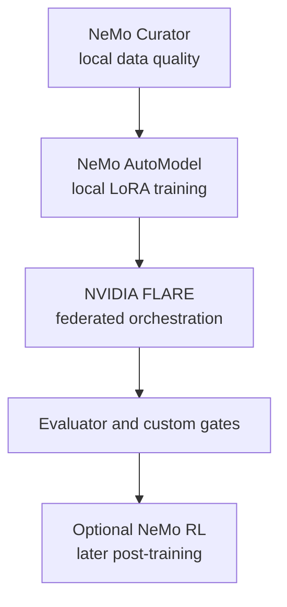

# Toolchain

[Overview](../../README.md) · [Architecture](architecture.md) · [Deployment](deployment.md) · [Workflow](workflow.md) · [Toolchain](toolchain.md) · [Governance](governance.md) · [Deutsch](../de/toolchain.md)

## Recommended open-source-oriented stack

| Layer | Candidate | Role | Position |
|---|---|---|---|
| Data preparation | [NeMo Curator](https://docs.nvidia.com/nemo/curator/latest/) | local filtering, deduplication, decontamination | targeted use |
| Fine-tuning | [NeMo AutoModel](https://docs.nvidia.com/nemo/automodel/latest/) | local SFT and LoRA/PEFT | preferred training layer |
| Federation | [NVIDIA FLARE](https://nvflare.readthedocs.io/en/main/) | orchestration, policy, protected aggregation | core federated layer |
| Evaluation | [NeMo Evaluator](https://docs.nvidia.com/nemo/evaluator) plus custom tests | reproducible model evaluation | framework, not sole authority |
| Post-training | [NeMo RL](https://docs.nvidia.com/nemo/rl/index.html) | preference learning or RL | later, after reliable feedback |
| Scale-up | [NeMo Framework](https://docs.nvidia.com/nemo-framework/index.html) / [Megatron Core](https://docs.nvidia.com/megatron-core/developer-guide/latest/) | large or distributed training | only after measured need |
| Inference | [TensorRT-LLM](https://docs.nvidia.com/tensorrt-llm/) | optional local optimisation | after model validation |

The exact release, repository licence, bundled dependencies, container terms, and model licence require verification before implementation. See [Open-Source Tool Baseline](../../OPEN_SOURCE_BASELINE.md).

[NVIDIA NIM](https://docs.nvidia.com/nim/large-language-models/latest/introduction.html) and [NeMo Microservices](https://docs.nvidia.com/nemo/microservices/latest/) are not part of the strict open-source baseline. They may be compared as product options but require a separate commercial and legal decision.

## Product and service reference { #product-and-service-reference }

The links below lead to official product or project documentation. Inclusion explains the architecture; it does not approve a licence, subscription, model, deployment, or specific release.

### Microsoft and cloud platform

| Product or service | What it is | Role and boundary in this design | Official reference |
|---|---|---|---|
| Microsoft 365 | Microsoft's cloud productivity and collaboration suite | tenant boundary containing the authorised source estate | [Microsoft 365 documentation](https://learn.microsoft.com/en-us/microsoft-365/) |
| SharePoint Online | document and collaboration service within Microsoft 365 | authoritative document store, permissions, versions, retention, and labels | [SharePoint introduction](https://learn.microsoft.com/en-us/sharepoint/introduction) |
| Microsoft Entra ID | cloud identity and access-management service | authenticates people and gives each engagement workload a separately governed identity | [What is Microsoft Entra?](https://learn.microsoft.com/en-us/entra/fundamentals/what-is-entra) |
| Microsoft Graph | REST API and SDK gateway to Microsoft cloud data | read-only access path to explicitly assigned SharePoint resources; not a new permission system | [Microsoft Graph overview](https://learn.microsoft.com/en-us/graph/overview) |
| Microsoft Purview Information Barriers | policy controls restricting communication and collaboration between defined segments | supports human and site separation; app-only access still needs an independent boundary review | [Information Barriers with SharePoint](https://learn.microsoft.com/en-us/purview/information-barriers-sharepoint) |
| Microsoft Azure | commercial cloud platform | hosts the isolated engagement spokes and central platform hub; outside the strict OSS baseline | [Azure documentation](https://learn.microsoft.com/en-us/azure/) |
| Azure Virtual Network | isolated software-defined network in Azure | forms each hub or spoke network boundary and carries explicitly allowed routes only | [Virtual Network overview](https://learn.microsoft.com/en-us/azure/virtual-network/virtual-networks-overview) |
| Azure Kubernetes Service (AKS) | managed Kubernetes service | one possible workload runtime; namespaces alone are not treated as the production information barrier | [AKS overview](https://learn.microsoft.com/en-us/azure/aks/what-is-aks) |
| Azure Virtual Machines / VM Scale Sets | managed virtual-compute instances and scalable groups | alternative hardened runtime where dedicated infrastructure is preferred over AKS | [Virtual Machines](https://learn.microsoft.com/en-us/azure/virtual-machines/overview) · [VM Scale Sets](https://learn.microsoft.com/en-us/azure/virtual-machine-scale-sets/overview) |
| Azure Private Link Service | private connectivity for a service through Azure private endpoints | optional private exposure of the central FLARE endpoint across network boundaries | [Private Link Service overview](https://learn.microsoft.com/en-us/azure/private-link/private-link-service-overview) |
| Azure Key Vault | managed store for keys, secrets, and certificates | possible protected storage for per-engagement keys and FLARE site credentials | [Key Vault overview](https://learn.microsoft.com/en-us/azure/key-vault/general/overview) |

### Open data and packaging components

| Component | What it is | Role and boundary in this design | Official reference |
|---|---|---|---|
| PostgreSQL | open-source relational database | optional local metadata and evidence store inside an engagement cell | [PostgreSQL documentation](https://www.postgresql.org/docs/) |
| pgvector | open-source PostgreSQL extension for vector similarity search | optional local retrieval index; vectors remain private to the engagement | [pgvector project and licence](https://github.com/pgvector/pgvector) |
| Open Container Initiative (OCI) | open specifications for container images, runtimes, and distribution | interoperability basis for the private image registry; not a registry product | [OCI specifications](https://opencontainers.org/) |

### Publication layer

| Product | What it is | Use in this repository | Official reference |
|---|---|---|---|
| GitHub Pages | static website hosting from a GitHub repository | publishes the reviewed Markdown presentation from the committed source | [GitHub Pages documentation](https://docs.github.com/en/pages/getting-started-with-github-pages/what-is-github-pages) |
| Material for MkDocs | open-source documentation theme and site generator integration | renders the bilingual presentation; the exact dependency is pinned in [`requirements-pages.txt`](https://github.com/ofunk-nvidia/Federated/blob/main/requirements-pages.txt) | [Material for MkDocs documentation](https://squidfunk.github.io/mkdocs-material/) |
| Mermaid | text-based diagram syntax and renderer | keeps architecture diagrams reviewable in Markdown and renderable on GitHub | [Mermaid documentation](https://mermaid.js.org/intro/) |

## Key terms

| Term | Meaning here |
|---|---|
| RAG | retrieval-augmented generation: retrieve authorised local evidence at request time instead of placing that evidence in shared model weights |
| SFT | supervised fine-tuning on reviewed input/output examples |
| LoRA / PEFT | parameter-efficient tuning methods that update a small adapter rather than every base-model parameter |
| Differential privacy (DP) | calibrated noise and contribution limits used to reduce, not eliminate, disclosure risk |
| HSM | hardware security module used to protect cryptographic keys and signing operations |
| SBOM | software bill of materials listing software components and versions for review and vulnerability management |

## Responsibility split

## Selection principle

The stack is modular. NVIDIA FLARE does not decide data rights or replace the local trainer. NeMo tools do not replace engagement access control, independent legal review, or leakage testing. Every component must earn its place through a measured POC.
