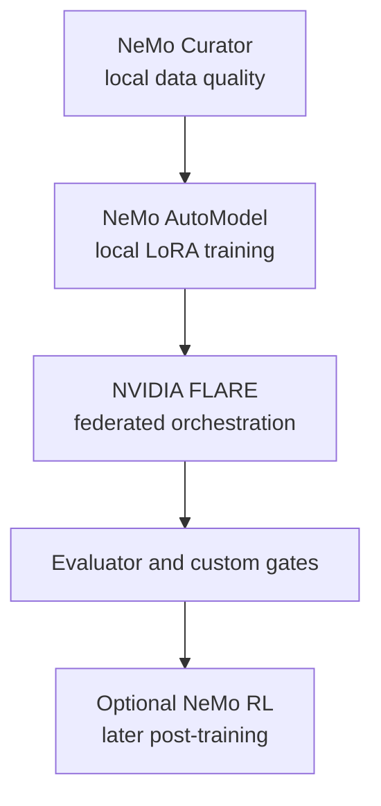

# Toolchain

[Overview](../../README.md) · [Architecture](architecture.md) · [Deployment](deployment.md) · [Workflow](workflow.md) · [Toolchain](toolchain.md) · [Governance](governance.md) · [Deutsch](../de/toolchain.md)

## Recommended open-source-oriented stack

| Layer | Candidate | Role | Position |
|---|---|---|---|
| Data preparation | NeMo Curator | local filtering, deduplication, decontamination | targeted use |
| Fine-tuning | NeMo AutoModel | local SFT and LoRA/PEFT | preferred training layer |
| Federation | NVIDIA FLARE | orchestration, policy, protected aggregation | core federated layer |
| Evaluation | NeMo Evaluator plus custom tests | reproducible model evaluation | framework, not sole authority |
| Post-training | NeMo RL | preference learning or RL | later, after reliable feedback |
| Scale-up | NeMo Framework / Megatron Core | large or distributed training | only after measured need |
| Inference | TensorRT-LLM | optional local optimisation | after model validation |

The exact release, repository licence, bundled dependencies, container terms, and model licence require verification before implementation. See [Open-Source Tool Baseline](../../OPEN_SOURCE_BASELINE.md).

NVIDIA NIM and NeMo Microservices are not part of the strict open-source baseline. They may be compared as product options but require a separate commercial and legal decision.

## Responsibility split

## Selection principle

The stack is modular. NVIDIA FLARE does not decide data rights or replace the local trainer. NeMo tools do not replace engagement access control, independent legal review, or leakage testing. Every component must earn its place through a measured POC.
