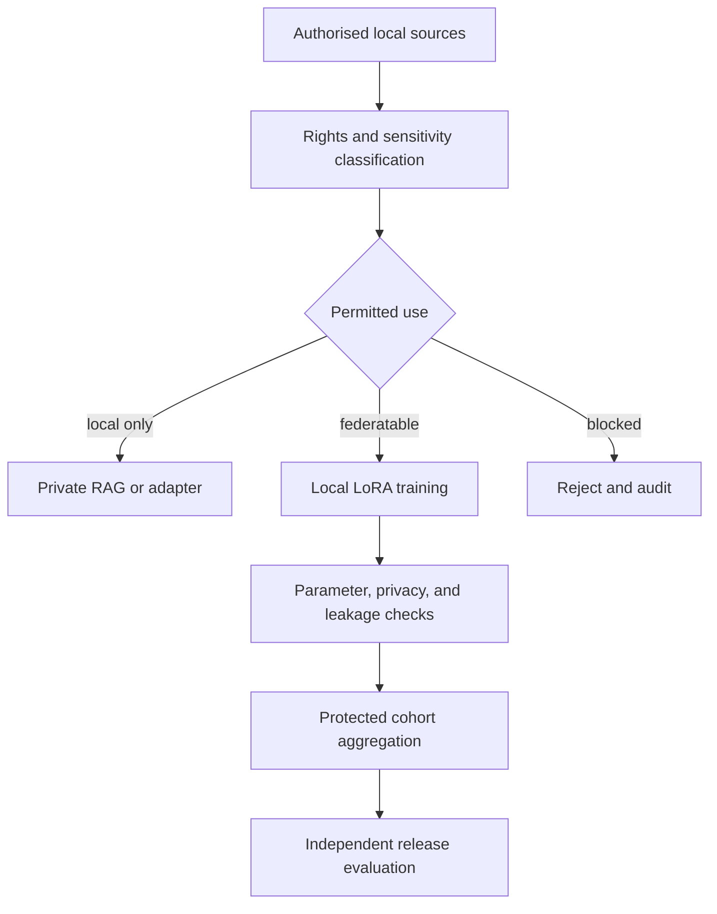

# Workflow

[Overview](../../README.md) · [Architecture](architecture.md) · [Deployment](deployment.md) · [Workflow](workflow.md) · [Toolchain](toolchain.md) · [Governance](governance.md) · [Deutsch](../de/workflow.md)

## Controlled learning cycle

## Proof-of-concept sequence

| Stage | Question | Exit evidence |
|---|---|---|
| 0. Decisions | What is allowed, useful, and measurable? | threat model, licences, owners, metrics |
| 1. Isolation | Can three synthetic sites remain separated? | negative access tests |
| 2. Local baseline | Does local RAG or LoRA add value? | frozen-base comparison |
| 3. Federation | Can compatible adapters be aggregated? | reproducible cross-site run |
| 4. Privacy | What do clipping, DP, or protected aggregation cost? | utility/privacy benchmark |
| 5. Red team | Can canaries or site identity be extracted? | documented attack results |
| 6. Decision | Is a customer lab justified? | go, change, or stop recommendation |

## Minimum release evidence

- provenance and usage class for every training example;
- exact model, adapter, job, policy, and dependency versions;
- minimum-cohort enforcement and update-schema validation;
- utility comparison with a frozen base model and local-only alternatives;
- memorisation, extraction, membership, and cross-engagement tests;
- signed approvals and documented residual risks;
- recall, revocation, incident, and engagement-exit procedure.

The POC described here is a blueprint only. Execution belongs in a separate approved private repository.
